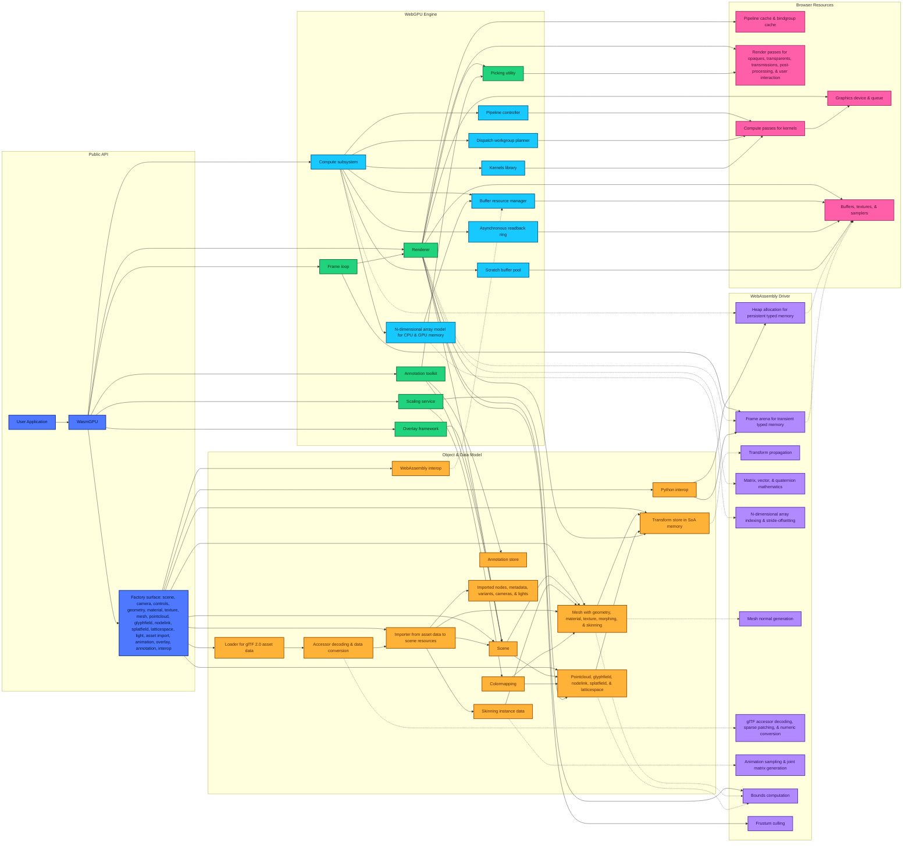

# WasmGPU Architecture

Latest commit: Thursday, August 13, 2026, [**`current`**](https://www.github.com/Zushah/WasmGPU/commit/HEAD).

Parent commit: Tuesday, August 11, 2026, [**`d203dfb`**](https://www.github.com/Zushah/WasmGPU/commit/d203dfb).

Latest release: Monday, July 27, 2026, [**`v0.9.0`**](https://www.github.com/Zushah/WasmGPU/releases/tag/v0.9.0).

## Contents

- [1. Architecture](#1-architecture)
  - [1.1. Architecture diagram](#11-architecture-diagram)
  - [1.2. Public API surface](#12-public-api-surface)
  - [1.3. Runtime creation and frame loop](#13-runtime-creation-and-frame-loop)
  - [1.4. WebGPU engine](#14-webgpu-engine)
  - [1.5. Scene and object model](#15-scene-and-object-model)
  - [1.6. Transforms](#16-transforms)
  - [1.7. Geometry, materials, textures, and colormaps](#17-geometry-materials-textures-and-colormaps)
  - [1.8. Pointcloud, glyphfield, nodelink, splatfield, and latticespace data](#18-pointcloud-glyphfield-nodelink-splatfield-and-latticespace-data)
  - [1.9. Lights, cameras, and controls](#19-lights-cameras-and-controls)
  - [1.10. Rendering pipeline](#110-rendering-pipeline)
  - [1.11. Browser runtime resources](#111-browser-runtime-resources)
  - [1.12. Picking, overlays, and annotations](#112-picking-overlays-and-annotations)
  - [1.13. Compute and ndarray systems](#113-compute-and-ndarray-systems)
  - [1.14. Scaling service](#114-scaling-service)
  - [1.15. Asset loading and glTF import](#115-asset-loading-and-gltf-import)
  - [1.16. Animating, skinning, and morphing](#116-animating-skinning-and-morphing)
  - [1.17. Python interop](#117-python-interop)
  - [1.18. WebAssembly driver](#118-webassembly-driver)
  - [1.19. Shader organization](#119-shader-organization)
  - [1.20. Per-frame work and performance-sensitive paths](#120-per-frame-work-and-performance-sensitive-paths)
  - [1.21. Visible invariants](#121-visible-invariants)
- [2. Codebase](#2-codebase)
  - [2.1. Public API and entry points](#21-public-api-and-entry-points)
  - [2.2. Runtime and renderer](#22-runtime-and-renderer)
  - [2.3. Scene and world objects](#23-scene-and-world-objects)
  - [2.4. Graphics data](#24-graphics-data)
  - [2.5. Compute, ndarray, and scaling](#25-compute-ndarray-and-scaling)
  - [2.6. Asset loading and glTF](#26-asset-loading-and-gltf)
  - [2.7. Overlays and annotations](#27-overlays-and-annotations)
  - [2.8. Python and WebAssembly interop](#28-python-and-webassembly-interop)
  - [2.9. Rust driver](#29-rust-driver)
  - [2.10. WGSL shaders](#210-wgsl-shaders)
  - [2.11. Examples](#211-examples)
  - [2.12. Tests](#212-tests)
  - [2.13. Documentation and website](#213-documentation-and-website)
  - [2.14. Build, generated, and release files](#214-build-generated-and-release-files)
  - [2.15. Assets and repository metadata](#215-assets-and-repository-metadata)
- [3. Guidelines](#3-guidelines)
  - [3.1. Start with local context](#31-start-with-local-context)
  - [3.2. Code style and formatting](#32-code-style-and-formatting)
  - [3.3. Public API behavior](#33-public-api-behavior)
  - [3.4. TypeScript changes](#34-typescript-changes)
  - [3.5. Rust changes](#35-rust-changes)
  - [3.6. WGSL changes](#36-wgsl-changes)
  - [3.7. Memory and per-frame work](#37-memory-and-per-frame-work)
  - [3.8. Examples, documentation, and release-facing files](#38-examples-documentation-and-release-facing-files)
  - [3.9. Generated files and release artifacts](#39-generated-files-and-release-artifacts)
  - [3.10. Validation commands](#310-validation-commands)
  - [3.11. Commit messages](#311-commit-messages)
  - [3.12. Updating this file](#312-updating-this-file)

## 1. Architecture

### 1.1. Architecture diagram

This diagram describes the current source tree, including [unreleased work](https://www.github.com/Zushah/WasmGPU/compare/v0.9.0...main) after [v0.9.0](https://www.github.com/Zushah/WasmGPU/releases/tag/v0.9.0). Solid arrows indicate creation, ownership, stored references, or call direction. Dashed arrows indicate data movement through WebAssembly memory or WebGPU resources.

### 1.2. Public API surface

The public API is exported from `./src/index.ts`. It exports the `WasmGPU` class, the renderer, compute helpers, scaling helpers, world objects, graphics objects, glTF helpers, overlay and annotation types, Python interop, WebAssembly interop, and math helpers.

Applications normally enter through `WasmGPU.create(canvas, descriptor)` in `./src/core/engine.ts`. The runtime initializes WebAssembly, creates a WebGPU renderer, constructs the compute subsystem, and exposes factories for scenes, cameras, controls, geometry, materials, textures, meshes, pointclouds, glyphfields, nodelinks, splatfields, latticespaces, lights, glTF loading, animation, overlays, and annotations.

The public API reads and writes data owned by the objects it creates. For example, a `Mesh` owns a transform, references geometry and material objects, and may own skin or morph runtime state. `Geometry`, `PointCloud`, `GlyphField`, `NodeLink`, `SplatField`, and `LatticeSpace` keep CPU-side records for external WebAssembly memory upload paths only when configured to retain CPU data. `PointCloud`, `GlyphField`, `NodeLink`, `SplatField`, and `LatticeSpace` follow an explicit external-buffer ownership model of owning GPU buffers they create internally and destroying caller-supplied external buffers only when constructed with `ownBuffers: true`. `PointCloud` supports setter-level `ownBuffer: true` on point and color buffer replacement, `GlyphField` supports setter-level `ownBuffers: true` on instance-buffer replacement, `NodeLink` supports setter-level `ownBuffer: true` on per-channel node and edge buffer replacement, and `LatticeSpace` supports setter-level `ownBuffer: true` on data and mask buffer replacement. `DataMaterial` handles externally supplied data buffers differently because it does not destroy a `dataBuffer` supplied by the caller.

Before changing exported names, constructor descriptors, or factory return values, inspect `./src/index.ts`, `./src/core/engine.ts`, `./test/*.test.js`, and the examples under `./examples/`. Public API changes often require updates to examples and release-facing documentation when preparing a release.

### 1.3. Runtime creation and frame loop

Runtime creation starts in `./src/core/engine.ts`. `WasmGPU.create()` calls `initWebAssembly()` from `./src/wasm/index.ts`, then calls `Renderer.create()` from `./src/core/renderer.ts`. It then creates `Compute`, `ScaleService`, and `PerformanceStats` instances.

The runtime owns:

- the active renderer;
- the compute subsystem;
- the scaling service;
- performance stats;
- requestAnimationFrame loop state.

It also exposes accessors from `./src/wasm/index.ts` for the WebAssembly driver (`driver`) and the external WebAssembly interop (`webassembly`), alongside the Python interop (`python`) accessors from `./src/python/index.ts`.

`WasmGPU.run(callback)` starts a browser animation loop. Each frame resets the WebAssembly frame arena, computes timing values, invokes the callback, and records frame statistics. `WasmGPU.render(scene, camera)` delegates to `Renderer.render()`. If the runtime is not inside `run()`, it resets the frame arena before rendering.

`WasmGPU.destroy()` stops the frame loop, clears the scaling cache, destroys compute resources, and destroys the renderer. Contributors changing lifetime behavior should inspect both `./src/core/engine.ts` and the resource `destroy()` methods in the objects that can be attached to a scene.

### 1.4. WebGPU engine

The WebGPU engine coordinates the browser-facing parts of the runtime. Its main files are `./src/core/engine.ts`, `./src/core/renderer.ts`, the internal renderer helper modules under `./src/core/`, `./src/core/stats.ts`, `./src/core/transform.ts`, and the subsystem directories under `./src/`.

The engine reads scene objects, transform state, camera state, material state, texture state, compute descriptors, overlay descriptors, and WebAssembly memory views. It mutates cached renderer state, GPU buffers, bind groups, draw lists, pick state, performance counters, per-frame staging memory, and optional occlusion hierarchy resources used by render-only previous-frame occlusion culling.

`./src/core/renderer.ts` owns the public `Renderer` class and the renderer-facing orchestration path. It creates the WebGPU adapter, device, queue, context, fallback textures, global buffers, bind group layouts, pipeline caches, shader caches, draw-list pools, culling scratch state, pick resources, optional occlusion hierarchy textures and readback slots, and optional SMAA resources. Internal modules under `./src/core/` hold the mechanical helper bodies for resources, timing, postprocessing, transmission, drawlists, materials, objects, picking, and occlusion. `Renderer` is the only public runtime renderer class.

`./src/core/stats.ts` stores frame timing, GPU timing when timestamp queries are available, and frame counters. `./src/core/transform.ts` owns the global transform store and calls Rust functions for transform propagation.

### 1.5. Scene and object model

The scene model is implemented in `./src/world/scene.ts`. A `Scene` owns arrays of meshes, pointclouds, glyphfields, nodelinks, splatfields, latticespaces, lights, and a background color. It mutates those arrays through `add()`, `remove()`, `clear()`, and typed add/remove helpers.

The renderer reads visible scene objects through scene getters. It also reads scene lighting data and scene bounds. The scene limits non-ambient lights used for packed lighting data to `MAX_LIGHTS`, currently eight.

Objects in the scene own different data:

- `./src/world/mesh.ts`: geometry, material references, transform, optional skin, optional morph runtime state, visibility flags, and scene owner references. Mesh vertex and index data enters the renderer through `Geometry`.
- `./src/world/pointcloud.ts`: point data, optional borrowed external WebAssembly memory views, bounds, scale source metadata, colormap state, transform, GPU buffers, uniform buffers, optional CPU records for picking, and per-buffer ownership flags for external point and color buffers.
- `./src/world/glyphfield.ts`: glyph geometry, instance data, optional borrowed external WebAssembly memory views, scale source metadata, transform, GPU buffers, uniform buffers, optional CPU records for picking, and per-buffer ownership flags for external instance buffers.
- `./src/world/nodelink.ts`: node data, edge data, optional borrowed external WebAssembly memory views, node and edge rendering modes, scale source metadata, transform, GPU buffers, uniform buffers, optional CPU records for picking, and per-buffer ownership flags for external node and edge buffers.
- `./src/world/splatfield.ts`: Gaussian splat instance data, optional borrowed external WebAssembly memory views, packed GPU buffers, transform, bounds, optional CPU records for upload and bounds computation, and per-object ownership flags for external buffers.
- `./src/world/latticespace.ts`: regular 2D or 3D cell dimensions, X-fastest scalar/vector/RGBA data, optional activity masks, CPU/WebAssembly/GPU source ownership, scale and colormap state, analytic bounds, and retained cell records for picking.

Mesh geometry and materials are reference-counted. `Mesh.destroy()` detaches the mesh from scene owners, destroys morph runtime state, disposes the skin instance, disposes the transform, and releases geometry and material references. `Scene.clear()` and typed clear methods remove scene references; they do not call `destroy()` on removed objects. `Scene.destroy()` calls `destroy()` on current meshes, pointclouds, glyphfields, nodelinks, splatfields, and latticespaces, then clears lights. Pointcloud, glyphfield, nodelink, splatfield, and latticespace changes should be checked against renderer draw-list building, object-family culling behavior, GPU buffer ownership, picking paths, overlay legends where applicable, and tests.

### 1.6. Transforms

Transforms are implemented in `./src/core/transform.ts` and backed by WebAssembly memory. The global `TransformStore` uses structure-of-arrays storage for positions, rotations, scales, local matrices, world matrices, parent indices, and traversal order.

Each `Transform` object keeps JavaScript-side position, rotation, and scale arrays plus parent/child links. Mutating a transform marks it dirty. The store then calls Rust functions from `./rust/src/transform.rs` through `./src/wasm/index.ts` to compose local matrices and update world matrices.

The transform store mutates:

- WebAssembly memory for transform components and matrices;
- parent indices and ordered traversal data;
- dirty sets and free-list state.

Capacity growth allocates and copies replacement structure-of-arrays blocks before releasing the superseded WebAssembly allocations. Capacity-independent temporary vector and quaternion blocks remain attached to the active global store rather than being reallocated during growth. The renderer calls `Transform.updateAll()` before gathering draw lists. Cameras, scene objects, controls, animation clips, and glTF import all write transform data. Contributors changing transform behavior should preserve parent cycle checks, dirty marking, disposal checks, allocation replacement ordering, and the index mapping between TypeScript objects and WebAssembly slots.

### 1.7. Geometry, materials, textures, and colormaps

Graphics data is implemented under `./src/graphics/`.

`./src/graphics/geometry.ts` owns vertex arrays, index arrays, optional tangents, skinning attributes, morph target arrays, GPU vertex and index buffers, bounds, and reference counts. It can also borrow external `WasmMemoryView` sources for mesh vertex attributes and indices, explicitly refresh them, and upload active ranges into geometry-owned GPU buffers without owning or freeing the external WebAssembly memory. It calls Rust bounds and normal-generation functions through `./src/wasm/index.ts`; these synchronous operations use scoped WebAssembly heap scratch that is released after results are copied into JavaScript-owned arrays. Geometry factories create primitives such as boxes, spheres, cylinders, curves, surfaces, torus geometry, and prism geometry.

`./src/graphics/material.ts` implements `Material`, `UnlitMaterial`, `StandardMaterial`, `DataMaterial`, and `CustomMaterial`. Materials own uniform buffers, bind groups, texture references, WebGPU state flags, and dirty state. `StandardMaterial` currently includes glTF-style properties for base color, metallic roughness, normal maps, occlusion, emissive maps, clearcoat, transmission, volume, diffuse transmission, dispersion, specular, sheen, iridescence, anisotropy, index of refraction, and emissive strength.

`DataMaterial` reads f32 data or external GPU buffers, uses a `ScaleTransform`, and can feed the scaling service. It owns GPU data buffers created from CPU data; `setDataBuffer()` stores caller-provided buffer handles without marking them owned. `CustomMaterial` reads caller-provided WGSL and uniform definitions. Material changes should be checked against renderer pipeline selection, WGSL shader variants, bind group layout creation, texture upload paths, tests, and glTF import.

`./src/graphics/texture.ts` wraps image bytes, URLs, `ImageBitmap` sources, sampler descriptors, GPU textures, and mipmap generation. Texture upload is asynchronous and uses `createImageBitmap()` in browser contexts. Until upload completes, renderer paths use fallback texture resources.

`./src/graphics/colormap.ts` stores built-in or caller-provided color stops, optional CPU lookup tables, and optional caller-provided GPU texture views and samplers. It can create cached GPU lookup resources for a device, and CPU sampling works only for colormaps that have CPU lookup data.

### 1.8. Pointcloud, glyphfield, nodelink, splatfield, and latticespace data

Pointclouds, glyphfields, nodelinks, splatfields, and latticespaces are separate scene object types. They share several patterns: a transform, visibility flags, GPU buffer references, uniform buffers, bind groups, bounds, and renderer-owned draw-list state. Pointclouds, glyphfields, nodelinks, and latticespaces carry scale transform state plus optional CPU records for picking, while splatfields carry packed Gaussian attributes, optional CPU records for picking, and private renderer-side GPU sort state for transparent rendering.

`./src/world/pointcloud.ts` handles point records. It reads packed point attributes from typed arrays, borrowed external `WasmMemoryView<Float32Array>` sources, or an external GPU buffer, writes point and uniform GPU buffers, and computes bounds through Rust bounds helpers when CPU data is available or external WebAssembly data is explicitly refreshed with bounds recomputation. Pointcloud WebAssembly sources are borrowed, refresh is explicit, and upload copies the active packed f32 vec4 ranges into pointcloud-owned GPU buffers without freeing or owning the external WebAssembly memory. It owns GPU buffers it creates from CPU data or external WebAssembly sources and destroys caller-supplied external point and color buffers only when `ownBuffers: true` or setter-level `ownBuffer: true` is used. Its `destroy()` method always destroys the stored uniform buffer.

`./src/world/glyphfield.ts` handles instanced glyph geometry. It can read CPU arrays, internal WebAssembly structure-of-arrays pointers, borrowed external `WasmMemoryView<Float32Array>` sources, or external GPU buffers. It writes instance buffers and uniform buffers. Glyphfield external WebAssembly sources are borrowed, refresh is explicit, and upload copies active packed f32 vec4 channel ranges into glyphfield-owned GPU buffers without freeing or owning the external WebAssembly memory. It owns GPU buffers it creates from CPU arrays, internal WebAssembly pointers, or external WebAssembly sources and borrows caller-supplied external instance buffers by default, destroying them only when `ownBuffers: true` or setter-level `ownBuffers: true` is used. Glyph geometry is a `Geometry` reference used by the renderer; `GlyphField.destroy()` currently destroys the stored uniform buffer plus only the instance buffers it owns, and it disposes its transform. It does not release the geometry reference. Glyphfield bounds use Rust bounds helpers when CPU arrays, internal WebAssembly pointers, or explicitly refreshed external WebAssembly position/scale data are available.

`./src/world/nodelink.ts` handles node positions, node scalar or color data, node radii, edges, node geometry modes, edge geometry modes, separate node and edge scale transforms, separate colormaps, uniform data, and picking records. It can read CPU arrays, borrowed external `WasmMemoryView` sources, or external GPU buffers per channel. Nodelink external WebAssembly sources are borrowed, refresh is explicit, and upload copies active node and edge ranges into nodelink-owned GPU buffers without freeing or owning the external WebAssembly memory. It computes bounds from retained CPU node positions in TypeScript. Its update methods can queue or write GPU-buffer changes for node positions, edges, scalars, radii, and colors. It owns GPU buffers it creates from CPU data or external WebAssembly sources and borrows caller-supplied external node and edge buffers by default, destroying them only when `ownBuffers: true` or setter-level `ownBuffer: true` is used. Its `destroy()` method always destroys the stored uniform buffer. The renderer has nodelink draw and pick paths, and overlay legends can read nodelink scale and colormap state.

`./src/world/splatfield.ts` handles precomputed Gaussian splat records. It reads friendly CPU arrays, borrowed external `WasmMemoryView<Float32Array>` sources, or caller-supplied packed GPU buffers for center-plus-opacity, rotation, scale, and either direct color data or spherical harmonic color coefficients. Splatfield external WebAssembly sources are borrowed, refresh is explicit, and upload copies active packed ranges into splatfield-owned GPU buffers without freeing or owning the external WebAssembly memory. Splatfield keeps CPU arrays, external WebAssembly memory upload, and external GPU buffers as distinct source families. Spherical harmonic coefficients use flat f32 RGB-triple storage for degree 0 through degree 3 and can come from `sh0`, `sh1`, `sh2`, and `sh3` CPU arrays, an external `shBuffer`, or an external `wasmSphericalHarmonics` source. CPU direct colors in sRGB space are decoded to linear during packing. External direct colors in sRGB space and spherical harmonic colors in sRGB space are decoded in the shader. In spherical harmonic mode, the splatfield render shader evaluates RGB from the local-frame view direction; it does not rotate coefficients with Wigner-D matrices. Bounds can come from explicit descriptors or from conservative CPU-side center-plus-scale expansion. `SplatField.destroy()` destroys internally created buffers and optionally destroys caller-supplied external buffers when `ownBuffers: true`. The renderer treats splatfields as transparent-only objects, GPU-sorts each field by camera depth for rendering, includes them in nearest-footprint picking without consuming the sorted index buffer, but excludes them from occlusion culling.

`./src/world/latticespace.ts` handles regular 2D and 3D cell lattices. Public dimensions are spatial `[x, y]` or `[x, y, z]`, while flat data is C-compatible X-fastest storage: `x + width * y` in 2D and `x + width * (y + height * z)` in 3D. Dimensions and component count are immutable structural properties. Scalar, vector, RGBA, and solid-color visualization share scale, colormap, clipping, mask, filtering, ownership, WebAssembly refresh, and CPU-retention behavior with the other scientific primitives. Bounds are analytic from origin, spacing, cell scale, index range, and transform. The renderer draws one procedural quad for 2D lattices and procedural cube instances for 3D lattices; `cellScale < 1` exposes separated cell faces, while fully packed cells suppress shared internal faces. Transparent 3D lattices use a latticespace-private GPU radix sorter over implicit cell centers; it reuses the raw scan WGSL sources but does not use or extend the public compute kernel API. Picking returns exact linear and spatial cell indices, and opaque latticespaces participate in occlusion capture and filtering. This surface renderer does not implement raymarched participating-media volume rendering, bricking, or out-of-core streaming.

Before changing one of these object types, inspect the matching WGSL under `./src/wgsl/world/`, the renderer drawlist and object helper code under `./src/core/renderer.ts`, `./src/core/drawlists.ts`, `./src/core/objects.ts`, `./src/core/picking.ts`, and `./src/core/occlusion.ts` when applicable, picking types in `./src/world/picking.ts` when the object participates in picking, scale source descriptors in `./src/scaling/` when the object participates in scaling, and tests such as `./test/nodelink.test.js` or `./test/splatfield.test.js`.

### 1.9. Lights, cameras, and controls

Cameras are implemented in `./src/world/camera.ts`. The base `Camera` owns a transform and cached matrices. `PerspectiveCamera` and `OrthographicCamera` compute projection matrices and expose setters for projection parameters. The renderer updates perspective aspect ratio from the canvas before drawing.

Controls are implemented in `./src/world/controls.ts`. `NavigationControls` handles orbit, trackball, and fly modes, pointer, keyboard, and wheel input, damping, target state for target-centric modes, fitting to bounds, pointer lock, configurable fly yaw, and event listener cleanup. `OrbitControls`, `TrackballControls`, and `FlyControls` are mode-specific subclasses and runtime factories. Controls mutate camera transforms and emit events used by overlays.

Lights are implemented in `./src/world/light.ts`. Ambient, directional, point, and spot lights share a base class. Scene lighting data reads light colors, intensities, positions, directions, ranges, and cone angles. glTF import can bind light transforms so imported lights follow imported node transforms.

Camera, controls, and light changes should be checked against renderer uniform packing, scene bounds fitting, overlay projection, glTF camera and light import, and tests that inspect matrix or lighting output.

### 1.10. Rendering pipeline

The public renderer class is implemented in `./src/core/renderer.ts`. It stores the WebGPU device, queue, canvas context, and swapchain format. It owns renderer-created bind group layouts, fallback resources, pipeline caches, shader caches, model buffers, instance buffers, culling scratch memory, pick resources, optional occlusion hierarchy resources, and optional SMAA resources. The helper files under `./src/core/` split the implementation mechanically by responsibility: `./src/core/resources.ts`, `./src/core/timing.ts`, `./src/core/postprocessing.ts`, `./src/core/transmission.ts`, `./src/core/drawlists.ts`, `./src/core/materials.ts`, `./src/core/objects.ts`, `./src/core/picking.ts`, and `./src/core/occlusion.ts`.

`Renderer.create()` requests a WebGPU adapter and device. It currently supports descriptor fields for antialiasing, power preference, canvas format, frustum culling, frustum culling stats, occlusion culling, occlusion culling stats, and requested device limits such as maximum buffer and binding sizes.

`Renderer.render(scene, camera)` currently performs these steps:

- resize the canvas and recreate size-dependent resources when needed;
- reset model and instance buffer offsets;
- allocate camera, lighting, and model staging memory from the WebAssembly frame arena;
- update camera matrices and scene transforms;
- write camera and lighting uniforms;
- build unfiltered draw lists for meshes, pointclouds, glyphfields, nodelinks, splatfields, and latticespaces;
- aggregate render-only frustum culling stats when enabled;
- optionally reuse a valid previous-frame occlusion hierarchy to conservatively filter opaque meshes, pointclouds, glyphfields, nodelinks, and latticespaces;
- GPU-sort visible splats and transparent 3D lattice cells inside their respective renderer-private sort paths before transparent draw encoding;
- encode render passes for opaque objects, transmission copies and passes when needed, transparent objects, and optional SMAA;
- encode timestamp query resolve and readback when GPU timing is available;
- submit the command buffer;
- optionally capture a low-resolution opaque depth hierarchy for a later frame and schedule its readback without blocking the current frame.

The renderer reads scene objects, transform world matrices, material state, texture views, geometry buffers, pointcloud buffers, glyphfield buffers, nodelink buffers, splatfield buffers, latticespace data and mask buffers, camera matrices, light data, and WebAssembly culling results. It mutates GPU buffers, bind groups, pipeline caches, draw-list pools, pick textures, timing query buffers, private splatfield and latticespace sort buffers, internal counters, and the bounded ring of occlusion readback slots. Splatfield bind groups include a spherical harmonic storage-buffer binding; non-SH splatfields use a renderer-owned dummy buffer for that binding. Picking helpers are in `./src/core/picking.ts` while render-only previous-frame occlusion helpers are in `./src/core/occlusion.ts`. Note that picking and warmup do not apply render-only previous-frame occlusion filtering.

Changing render behavior usually means checking `./src/core/renderer.ts`, the relevant helper module(s) under `./src/core/`, the graphics classes in `./src/graphics/`, object classes in `./src/world/`, WGSL shader variants in `./src/wgsl/`, and renderer-focused tests in `./test/`.

### 1.11. Browser runtime resources

Browser runtime resources are WebGPU objects created and mutated by renderer and compute paths. The renderer creates the adapter, device, queue, canvas context, render targets, depth targets, texture views, samplers, bind group layouts, bind groups, render pipelines, and render pass descriptors. The compute subsystem stores device and queue references from the runtime and creates storage buffers, uniform buffers, compute pipelines, bind groups, scratch buffers, and readback staging buffers.

Geometry, materials, textures, pointclouds, glyphfields, nodelinks, splatfields, latticespaces, skin instances, and compute objects store WebGPU handles. Render and compute command encoding read those handles. Destruction paths exist for renderer resources, textures, geometry and material buffers, pointclouds, glyphfields, nodelinks, splatfields, latticespaces, private splatfield and latticespace sort scratch buffers, skin instances, compute buffers, readback rings, scratch pools, and GPUndarray-owned buffers. Compute pipeline wrappers do not expose a `destroy()` method because WebGPU pipeline objects are not explicitly destroyed.

Changing browser resource layout requires checking usage flags, bind group layout entries, pipeline layout creation, shader bindings, fallback resources, resize paths, and destruction paths. A resource layout change usually spans TypeScript, WGSL, and at least one test or example.

### 1.12. Picking, overlays, and annotations

Picking types and selection helpers are implemented in `./src/world/picking.ts`. The renderer keeps the public pick wrappers in `./src/core/renderer.ts`, while `./src/core/picking.ts` implements the actual pick passes. Pick rendering writes object and element identifiers into GPU textures, then reads back the requested pixel or region.

The runtime exposes `pick()`, `pickRect()`, and `pickLasso()` from `./src/core/engine.ts`. These methods call the renderer and then add object-specific attributes for pointclouds, glyphfields, nodelinks, splatfields, and latticespaces when CPU records are available. Retained splatfield CPU records can include direct color data or spherical harmonic degree and coefficient data. Picking is nearest-footprint/depth picking and does not evaluate spherical harmonic visual contribution. Pick preparation uses the renderer's base scene-preparation path only, so it does not apply render-only occlusion filtering and does not consume previous-frame occlusion results.

The overlay framework lives under `./src/overlay/`. `./src/overlay/system.ts` creates a DOM overlay root next to the canvas, tracks layers, observes resize and scroll changes, listens to controls when attached, and marks layers dirty for camera, viewport, layout, scale, colormap, or interaction changes. Built-in layers include axis triad, grid, and legend layers.

Annotations live under `./src/overlay/annotation/`. The annotation toolkit owns an `AnnotationStore`; `Scene` does not own annotation records. The store owns marker, distance, and angle records. The toolkit reads picking results, creates marker objects in the scene through the marker renderer, and creates labels through the label layer.

Overlay and annotation changes cross both DOM and WebGPU paths. Inspect layer types, projection helpers, picking behavior, annotation store revisions, marker scene objects, and examples that attach overlays to controls.

### 1.13. Compute and ndarray systems

The compute subsystem is implemented under `./src/compute/`. `./src/compute/index.ts` stores the WebGPU device and queue references used for compute work. It creates storage buffers, uniform buffers, compute pipelines, readback rings, scratch pools, ndarray objects, and an optional RGBA8 blitter.

The main compute files are:

- `./src/compute/buffer.ts`: storage and uniform GPU buffer wrappers, writes, reads, and typed reads.
- `./src/compute/pipeline.ts`: compute pipeline descriptors, pipeline creation, and bind group creation.
- `./src/compute/dispatch.ts`: command encoding and dispatch validation.
- `./src/compute/workgroups.ts`: workgroup size helpers.
- `./src/compute/kernels.ts`: built-in copy, reduce, arg-reduce, scan, histogram, compact, radix sort, scaling, and LU factor/solve kernels.
- `./src/compute/readback.ts`: reusable asynchronous GPU readback slots.
- `./src/compute/scratch.ts`: scratch buffer pooling.
- `./src/compute/ndarray.ts`: CPU and GPU ndarray layout, dtype, stride, offset, upload, and readback logic.
- `./src/compute/blit.ts`: RGBA8 storage-buffer-to-canvas blitting.

The compute subsystem reads WGSL from `./src/wgsl/compute/`, WebGPU buffer descriptors, ndarray descriptors, and caller-provided typed arrays. It mutates GPU buffers, command encoders, readback staging buffers, scratch pool entries, and WebAssembly-backed CPU ndarray memory. `CPUndarray` owns its backing bytes plus shape, stride, and indexing allocations; `destroy()` releases them idempotently and later memory access throws. `GPUndarray` destroys only buffers it owns and continues to borrow buffers supplied through `wrap()`.

Contributors changing compute code should check buffer usage flags, copy alignment, dispatch dimensions, shader bindings, readback slot reuse, and tests that assert kernel results.

### 1.14. Scaling service

The scaling service is implemented in `./src/scaling/service.ts` with scale transform logic in `./src/scaling/transform.ts`. It uses compute kernels to extract finite f32 values, compact them, compute min and max values, build histograms when percentile clamping is requested, and read results back asynchronously.

The service reads scale source descriptors from data materials, pointclouds, glyphfields, nodelinks, and latticespaces. It caches in-flight and completed results using source buffer identity, revision, component selection, value mode, stride, offset, count, transform settings, and percentile settings.

Scale transforms pack values for WGSL in a fixed float layout. The current modes include linear, logarithmic, and symmetric logarithmic behavior, plus range or percentile clamping, gamma, and inversion.

Changing scaling behavior requires checking `./src/scaling/`, data-source objects in `./src/graphics/material.ts` and `./src/world/`, WGSL scaling kernels under `./src/wgsl/compute/`, legend behavior under `./src/overlay/`, and examples that show colormap legends.

### 1.15. Asset loading and glTF import

glTF loading and import are implemented under `./src/gltf/`. The loader reads JSON `.gltf` files, binary `.glb` files, external buffers, embedded buffers, and image resources. URI resolution is implemented in `./src/gltf/uri.ts`; GLB parsing is in `./src/gltf/glb.ts`.

Root sources are fetched or read once, classified from the first four bytes, decoded with fatal UTF-8 JSON parsing when they are not GLB, and passed through the shared glTF compatibility gate. URL loads retain the exact response URL as `GltfDocument.resourceBaseUrl` for WHATWG external-resource resolution, while `baseUrl` remains the backward-compatible directory-style value; explicit bases and in-memory sources are normalized as directories. Data URLs are parsed as RFC 2397 octets, including percent-decoded bytes, literal plus signs, media-type parameters, and percent-escaped base64.

Accessor decoding is split between TypeScript and Rust. `./src/gltf/accessors.ts` reads accessor descriptors, buffer views, sparse data, component types, normalization rules, and typed-array output requirements. Numeric conversion, deinterleaving, and sparse patching call Rust functions in `./rust/src/accessors.rs`.

`./src/gltf/import.ts` converts loaded asset data into scene resources. Current import code covers geometry, materials, textures, skins, animations, morph targets, node transforms, node visibility, animation pointers, scene selection, metadata, material variants, cameras, punctual lights including spot lights, texture transforms, XMP metadata, Gaussian splat primitives from `KHR_gaussian_splatting` into `SplatField`, and material extensions for clearcoat, specular, transmission, volume, diffuse transmission, dispersion, sheen, iridescence, anisotropy, index of refraction, and emissive strength. `KHR_gaussian_splatting` import keeps spherical harmonic degree 0 through degree 3 data as `SplatField` coefficients when complete degree data is present.

Import performs a pure required-extension preflight before constructing scene or runtime resources. `extensionsRequired` failures are strict, while optional deferred features may use usable core representations with explicit warnings. `metadata.extensions.support` reports the per-asset outcome using `supported`, `partial`, `deferred`, and `unsupported`; outcomes degrade monotonically as asset-specific fallback or loss is discovered, and the same assessment feeds required-extension enforcement.

The importer mutates scenes, meshes, splatfields, geometry, materials, textures, animations, skin instances, camera data, and light bindings. It reads loaded asset data, WebAssembly decoding helpers, material extension descriptors, texture resources, and transform state. Before changing glTF import, check `./test/gltf.test.js`, examples using glTF, renderer material paths, texture upload behavior, and animation sampling.

### 1.16. Animating, skinning, and morphing

Animation code is implemented in `./src/graphics/animation.ts`. `AnimationClip` stores channels and samplers. It samples translation, rotation, scale, weight, and glTF animation-pointer channels. Transform sampling calls Rust functions in `./rust/src/anim.rs`; morph weight sampling and animation-pointer setter sampling are currently handled in TypeScript.

`AnimationPlayer` advances time, handles looping and clamping, and samples a clip. It mutates target transforms, morph weights, imported node visibility, material factors, texture transforms, camera projection properties, and punctual-light properties when a clip contains those channels.

`Skin` stores joint transform indices and inverse bind matrices in WebAssembly memory. `SkinInstance` owns a GPU bone buffer, bind group, and bind matrix memory. The renderer updates joint matrices through Rust before drawing skinned meshes. Shader variants under `./src/wgsl/graphics/` cover normal, skinned, and skinned8 paths.

Morph target runtime state is attached to meshes in `./src/world/mesh.ts`. When morph weights change, the mesh updates CPU-side morphed positions and normals, updates GPU buffers, and recomputes bounds used by the renderer.

Animation changes should be checked against glTF import, mesh morph handling, skin buffer layout, shader variants, and renderer draw-list paths.

### 1.17. Python interop

Python interop is implemented in `./src/python/index.ts` and `./src/python/interop.py`. The TypeScript side exposes `pythonInterop`, which can copy typed-array or Pyodide buffer data into WebAssembly memory and return ndarray handles that include pointer, dtype, shape, strides, offset, byte length, and ownership metadata.

`sendNdarray()` accepts JavaScript typed arrays, array-like values, or Pyodide buffer-like proxies. Python buffers must currently be C-contiguous. The function can allocate memory through the WebAssembly heap, frame arena, or a supplied `WasmHeapArena`.

`receiveNdarray()` reads a handle back into JavaScript memory. `view()`, `bytes()`, and `copyInto()` expose lower-level views and copies. Freeing a heap ndarray handle is idempotent, and later memory access through that handle is rejected. The Python helper file mirrors this lifetime state for Python callers.

Interop changes should preserve allocator ownership, frame arena lifetime checks, dtype mapping, stride handling, and error messages for unsupported layouts.

### 1.18. WebAssembly driver

WebAssembly driver initialization is implemented in `./src/wasm/driver.ts` and exported through `./src/wasm/index.ts`. It imports the generated loader from `./build/wasm.js`, creates an eight-mebibyte (8,388,608 bytes) frame arena, and exposes grouped Rust functions for accessors, animation, bounds, culling, matrix math, mesh normals, ndarray indexing, quaternion math, transforms, and vector math.

`WasmSlice`, `WasmHeapArena`, `frameArena`, `wasm`, and the `driver` namespace are part of the WebAssembly driver. `WasmSlice` records pointer, length, dtype, allocation kind, and epoch. Frame arena and heap arena slices check epochs so callers do not reuse memory after a reset or destroyed arena, and freed slices reject later view or handle creation. `WasmHeapArena` allocates a WebAssembly heap block and provides bump allocation within that block. Explicit release remains retryable if its allocator call throws; garbage-collection finalization is only a fallback for abandoned heap slices.

WebAssembly interop with external modules lives in `./src/wasm/interop.ts`. It wraps foreign `WebAssembly.Instance` or exports objects, resolves explicit memory and export descriptors, validates byte ranges and alignment, constructs typed views or raw byte/DataView accessors over external linear memory, and provides small shared validation helpers for object-owned uploads from borrowed `WasmMemoryView` sources.

Rust memory allocation is implemented in `./rust/src/heap.rs` through Rust's standard allocator. Exported byte, `f32`, and `u32` allocation/free pairs use checked layouts; a successful allocation remains valid until its matching one-time free, after which its storage can be reused. WebAssembly memory pages do not shrink after growth. `WasmHeapArena.destroy()` releases its backing heap block, while the frame arena keeps one persistent backing block and reuses its contents through resets.

The Rust driver separates portable slice and fixed-array computation from WebAssembly-only heap and frame-arena adapters where native testing requires it. The heap and frame-arena modules compile only for `wasm32`; their 32-bit pointer, memory-growth, alignment, capacity, and epoch contracts are tested against the compiled WebAssembly module rather than emulated with native pointers.

Each Rust ABI entry point that borrows WebAssembly memory creates an opaque driver-call scope inside a higher-ranked callback. Slice helpers consume a copy of that capability and return references tied to its generated lifetime, so the compiler prevents those references from escaping the driver call rather than relying on an unconstrained or fabricated static lifetime. Pointer-consuming and deallocation exports are `unsafe extern "C"` functions on the Rust side, so Rust callers must acknowledge their foreign-memory preconditions at each call site; this marker does not change their WebAssembly signatures, so JavaScript callers remain responsible for the same ABI contract. Fixed-width matrix, quaternion, and vector kernels stage their inputs in local arrays before creating mutable output slices, so output may exactly alias or partially overlap an input without violating Rust's reference-aliasing rules. Their `copy` exports use memmove semantics and support exact, forward, and backward overlap. Variable-length accessor, animation, bounds, culling, mesh, ndarray, and transform kernels require every pointer range to be valid, initialized, naturally aligned for its element type, contained within its live allocation, and large enough for the supplied count; mutable output ranges must be mutually disjoint and must not overlap input ranges unless an export explicitly documents otherwise.

Data movement commonly follows these paths:

- TypeScript typed arrays are copied into WebAssembly memory for Rust processing.
- Rust writes results into WebAssembly memory views read by TypeScript.
- TypeScript writes WebAssembly-backed views or JavaScript typed arrays into GPU buffers through WebGPU queue writes.
- GPU readbacks copy GPU buffer ranges into staging buffers, map them asynchronously, and return JavaScript typed arrays.
- Textures upload through browser image and bitmap APIs before becoming WebGPU texture views.

Changing memory movement requires checking alignment, buffer usage flags, frame arena epochs, heap arena ownership, typed-array lifetimes, and GPU resource destruction.

### 1.19. Shader organization

WGSL shaders live under `./src/wgsl/`. They are imported as text into TypeScript and bundled by `./esbuild.config.js`, whose WGSL plugin removes comments and extra whitespace.

Shader directories currently map to architecture areas:

- `./src/wgsl/core/`: SMAA, mesh picking shaders, mesh occlusion capture, and occlusion hierarchy reduction.
- `./src/wgsl/graphics/`: mesh material shaders, transmission shaders, data material shaders, custom material defaults, mipmap generation, and skinned or instanced variants.
- `./src/wgsl/world/`: pointcloud, glyphfield, nodelink, splatfield, latticespace, picking, private splatfield and latticespace sorting, and object-family occlusion capture shaders.
- `./src/wgsl/compute/`: copy, reduce, arg-reduce, scan, histogram, compact, radix sort, scaling, and blit kernels.

WGSL changes must stay in sync with bind group layouts, vertex buffer layouts, uniform packing, material descriptors, object uniform layouts, and compute pipeline resource bindings in TypeScript.

### 1.20. Per-frame work and performance-sensitive paths

Per-frame work spans TypeScript, WebAssembly, and WebGPU:

- `WasmGPU.run()` resets the frame arena and calls the frame callback.
- `Renderer.render()` updates canvas-sized resources, camera matrices, transforms, lighting uniforms, unfiltered draw lists, render-only culling stats, optional previous-frame occlusion filtering of opaque lists, GPU uploads, render passes, optional post-processing, timing readback, and optional asynchronous occlusion hierarchy capture.
- Transform propagation runs in Rust using WebAssembly memory.
- Culling and bounds helpers run in Rust when enabled by renderer paths. Current Rust culling work includes frustum culling and conservative previous-frame hierarchical-Z occlusion tests over world-space spheres.
- Animation sampling mutates transforms and morph weights before rendering when the application updates players.
- Overlay updates are DOM work and can be marked dirty by camera, viewport, scale, colormap, or interaction changes.

The code contains several performance-sensitive patterns: reusable draw-list arrays, draw item pools, model buffer pools, pipeline and shader caches, bind group caches, culling scratch buffers, frame arena staging memory, scratch compute buffers, and readback ring slots. The occlusion path uses a bounded ring of hierarchy readback slots and intentionally becomes a no-op when no safe previous-frame hierarchy is ready. Changes in these areas should avoid new per-object or per-frame allocations unless the allocation is bounded and measured.

### 1.21. Visible invariants

These invariants are visible in the current code:

- WebAssembly must be initialized before code calls Rust-backed functions or reads `wasm` exports.
- Frame arena memory is valid only for the current frame arena epoch.
- `WasmHeapArena` slices are invalid after the arena is reset or destroyed.
- Python interop heap ndarray handles reject memory access after their idempotent free operation.
- Destroyed `CPUndarray` objects reject WebAssembly pointer and data access, and repeated destruction is harmless.
- Disposed animation clips, skins, and skin instances reject operations that would consume their released WebAssembly allocations.
- Rust heap allocations remain valid until their matching one-time free; freed storage is reusable, but WebAssembly memory pages do not shrink.
- Transform and renderer culling capacity growth releases superseded WebAssembly blocks only after replacement allocation succeeds; renderer destruction releases its final culling blocks.
- Transform indices map TypeScript `Transform` objects to WebAssembly transform slots.
- Disposed transforms throw on later use.
- Transform parenting rejects cycles.
- The renderer calls transform updates before reading world matrices for draw lists.
- Render-only previous-frame occlusion culling reuses hierarchy data only when viewport size, hierarchy layout, camera type, view-projection matrix, and occluder signature still match; otherwise it is skipped for that frame.
- Render-only occlusion filtering never runs for picking or warmup.
- Geometry and materials use reference counts, and meshes release references on destruction.
- Imported glTF node visibility has local and effective state; effective visibility fans out to attached meshes and lights, while cameras remain importable and unaffected by visibility.
- Scene lighting uniform data currently uses at most eight non-ambient lights.
- WebGPU buffer readback requires buffers with copy-source usage.
- Buffer writes are padded to four-byte alignment where needed.
- Opaque occluder capture uses only coverage-safe subsets of meshes, pointclouds, glyphfields, nodelinks, and latticespaces; splatfields are currently excluded from occlusion capture and render-only occlusion filtering.
- Picking attributes for pointclouds, glyphfields, nodelinks, splatfields, and latticespaces depend on retained CPU-side records.
- Pointcloud, glyphfield, nodelink, splatfield, and latticespace external GPU buffers are borrowed by default and are destroyed only when their ownership options request it.
- Shader uniform layouts, TypeScript packing code, and WGSL structs must match.

## 2. Codebase

### 2.1. Public API and entry points

Architectural role:

- Implements the Public API area in the diagram.
- Creates runtime objects and exposes factory helpers.
- Re-exports types and classes from the rest of `./src/`.

Important files:

- `./src/index.ts`: main module export surface. Check this file before adding or renaming public classes, descriptors, or helper functions.
- `./src/index.iife.ts`: browser global entry point for IIFE bundles. It imports the public API and attaches it for script-tag examples and bundles.
- `./src/core/engine.ts`: `WasmGPU` runtime class, factory methods, frame loop, renderer delegation, picking wrappers, interop accessors, and destruction.

Common interactions:

- `./src/index.ts` imports from every public subsystem.
- `./src/core/engine.ts` creates `Renderer`, `Compute`, `ScaleService`, scene objects, cameras, controls, overlays, annotations, glTF helpers, and animation objects.
- Examples under `./examples/` use the exported API directly.

### 2.2. Runtime and renderer

Architectural role:

- Implements the WebGPU Engine and most Browser Resources areas in the diagram.
- Reads scene and graphics data.
- Writes WebGPU commands, GPU buffers, caches, timing data, and pick results.

Important files:

- `./src/core/renderer.ts`: public `Renderer` class and orchestrator. It creates the WebGPU device and context, configures limits, owns renderer state, coordinates the helper modules below, preserves the public renderer API surface, and keeps render, warmup, resize, pick wrapper, and destroy sequencing in one place.
- `./src/core/resources.ts`: renderer-global buffers, fallback textures, staging views, object IDs, and uniform writes.
- `./src/core/timing.ts`: GPU timestamp-query setup and readback.
- `./src/core/postprocessing.ts`: current SMAA resource creation, resize, and execution.
- `./src/core/transmission.ts`: transmission target lifecycle and transmissive draw detection.
- `./src/core/drawlists.ts`: drawitem pools, drawlist building, culling-capacity helpers, and transparent merged execution.
- `./src/core/materials.ts`: material pipeline, shader-module, bind-group, blend, and cull helpers.
- `./src/core/objects.ts`: mesh, pointcloud, glyphfield, nodelink, splatfield, and latticespace helpers, including renderer-private sort state.
- `./src/core/picking.ts`: pick target resources, pick queries, pick draw execution, and pick pipelines.
- `./src/core/occlusion.ts`: render-only previous-frame occlusion resource lifecycle, hierarchy validity checks, conservative opaque filtering, capture/readback, and occlusion pipelines.
- `./src/core/transform.ts`: global transform store and `Transform` class. It stores transform data in WebAssembly memory and calls Rust transform functions.
- `./src/core/stats.ts`: frame and GPU timing counters plus the nested public culling stats display used by the runtime.
- `./src/utils/index.ts`: shared internal helpers used across subsystems.

Contributors should inspect `./src/core/renderer.ts` together with the object class, material class, and shader file for any feature that changes draw behavior. Renderer changes often affect tests, examples, and shader layouts.

### 2.3. Scene and world objects

Architectural role:

- Implements the Object & Data Model area in the diagram.
- Supplies renderable and pickable objects to the renderer.
- Contains scene composition, renderable object types, bounds helpers, cameras, controls, lights, picking types, and selection helpers.

Important files:

- `./src/world/scene.ts`: scene object arrays, add/remove helpers, light packing, bounds collection, and traversal.
- `./src/world/mesh.ts`: mesh lifetime, transform ownership, material and geometry references, scene owner references, skin attachment, and morph runtime state.
- `./src/world/pointcloud.ts`: point data, GPU-buffer upload, CPU-array upload, WASM-memory upload, scale source metadata, bounds, and picking records.
- `./src/world/glyphfield.ts`: glyph instance data, geometry modes, GPU-buffer upload, CPU-array upload, WASM-memory upload, scale source metadata, bounds, and picking records.
- `./src/world/nodelink.ts`: node and edge data, rendering modes, GPU-buffer upload, CPU-array upload, WASM-memory upload, scale source metadata, bounds, and picking records.
- `./src/world/splatfield.ts`: Gaussian splat data, direct colors, spherical harmonic coefficient data, GPU-buffer upload, CPU-array upload, WASM-memory upload, bounds, color-space handling, and picking records.
- `./src/world/latticespace.ts`: regular 2D/3D cell data, X-fastest indexing, masks, GPU-buffer upload, CPU-array upload, WASM-memory upload, analytic bounds, scale and colormap state, and picking records.
- `./src/world/camera.ts`: base, perspective, and orthographic cameras.
- `./src/world/controls.ts`: navigation controls, orbit controls, trackball controls, fly controls, pointer and keyboard input, damping, pointer lock, and scene fitting.
- `./src/world/light.ts`: ambient, directional, point, and spot lights plus glTF light transform binding helpers.
- `./src/world/picking.ts`: pick result types, region query types, and `SelectionStore`.
- `./src/world/bounds.ts`: bounds helpers.

Common interactions:

- `./src/core/renderer.ts` reads visible world objects and their GPU resources.
- `./src/gltf/import.ts` creates and mutates world objects from assets.
- `./src/overlay/annotation/` creates marker objects and reads picking results.
- `./src/scaling/` reads scale source descriptors from pointclouds, glyphfields, nodelinks, latticespaces, and data materials.

### 2.4. Graphics data

Architectural role:

- Implements mesh data, materials, textures, color maps, animation, skinning, and morph target support.
- Supplies GPU resources and uniform data to the renderer.
- Reads WebAssembly helpers for bounds, normals, animation, and math.

Important files:

- `./src/graphics/geometry.ts`: vertex data, index data, WASM-memory upload, tangent generation, normal generation, bounds, morph target arrays, GPU buffers, reference counting, and primitive geometry factories.
- `./src/graphics/material.ts`: material base class, unlit material, standard material, data material, custom material, uniform packing, texture references, bind groups, and reference counting.
- `./src/graphics/texture.ts`: texture descriptors, image loading, GPU texture upload, mipmap generation, sampler setup, fallback behavior, and destruction.
- `./src/graphics/colormap.ts`: built-in and caller-provided color stops, CPU lookup tables, optional external GPU texture views, GPU resource caching, and CPU sampling helpers.
- `./src/graphics/animation.ts`: animation clips, players, skins, skin instances, transform sampling, morph weight sampling, and bone buffer updates.

Common interactions:

- `./src/core/renderer.ts` reads graphics data and binds buffers, textures, samplers, and material uniforms.
- `./src/gltf/import.ts` creates geometry, materials, textures, animations, skins, and morph data.
- `./src/wgsl/graphics/` must match material and geometry layouts.
- Tests under `./test/material.test.js`, `./test/geometry.test.js`, `./test/mesh.test.js`, `./test/renderer.test.js`, and `./test/gltf.test.js` cover important behavior.

### 2.5. Compute, ndarray, and scaling

Architectural role:

- Implements the Compute subsystem, N-dimensional array model, readback ring, scratch buffer pool, and Scaling service areas in the diagram.
- Stores device and queue references for compute work.
- Creates compute pipelines and buffer wrapper objects; returned wrappers own or reference their WebGPU handles.
- Supplies data scaling for visual objects and data materials.

Important files:

- `./src/compute/index.ts`: `Compute` facade, buffer creation, pipeline creation, dispatch helpers, readback rings, ndarray factories, and blitter creation.
- `./src/compute/buffer.ts`: storage and uniform buffer wrappers.
- `./src/compute/pipeline.ts`: compute pipeline wrapper and bind group creation.
- `./src/compute/dispatch.ts`: compute pass encoding.
- `./src/compute/workgroups.ts`: workgroup normalization and size helpers.
- `./src/compute/kernels.ts`: built-in compute kernels.
- `./src/compute/readback.ts`: asynchronous readback ring.
- `./src/compute/scratch.ts`: scratch GPU buffer pool.
- `./src/compute/ndarray.ts`: CPU and GPU ndarray classes, dtype handling, shape and stride validation, deterministic WebAssembly-backed CPU allocation lifetime, upload, and readback.
- `./src/compute/blit.ts`: RGBA8 compute output blitting.
- `./src/scaling/service.ts`: cached statistics requests over GPU data.
- `./src/scaling/transform.ts`: scale transform packing and CPU-side helpers.
- `./src/scaling/types.ts`: scaling descriptors and enums.
- `./src/scaling/index.ts`: scaling exports.

Common interactions:

- `./src/world/pointcloud.ts`, `./src/world/glyphfield.ts`, `./src/world/nodelink.ts`, `./src/world/latticespace.ts`, and `./src/graphics/material.ts` expose scale sources.
- `./src/overlay/legendLayer.ts` reads scaling and colormap state for legends.
- WGSL kernels under `./src/wgsl/compute/` implement GPU work.

### 2.6. Asset loading and glTF

Architectural role:

- Implements the asset loading, glTF accessor, and importer areas in the diagram.
- Converts asset data into scene, graphics, splatfield, animation, camera, and light objects.
- Uses Rust for hot accessor conversion paths.

Important files:

- `./src/gltf/index.ts`: public glTF exports.
- `./src/gltf/types.ts`: loaded asset, descriptor, accessor, and extension types.
- `./src/gltf/loader.ts`: asset loading, buffer loading, image loading, and resource resolution.
- `./src/gltf/glb.ts`: binary GLB parsing.
- `./src/gltf/uri.ts`: URI handling.
- `./src/gltf/accessors.ts`: accessor decoding and conversion.
- `./src/gltf/import.ts`: conversion from loaded asset data to scene resources.

Common interactions:

- `./src/gltf/import.ts` creates objects from `./src/world/` and `./src/graphics/`.
- `./src/gltf/accessors.ts` calls Rust accessors through `./src/wasm/index.ts`.
- `KHR_gaussian_splatting` mesh primitives import into `SplatField` scene objects for the supported Gaussian splat subset.
- Unsupported optional `KHR_gaussian_splatting` primitive features are skipped with warnings rather than converted to fallback pointclouds.
- glTF animation pointers compile to existing transform and morph paths when possible and to JavaScript setters for imported nodes, materials, cameras, and lights.
- Material extension import must match `StandardMaterial` fields and renderer shader support.
- glTF changes should be checked against `./test/gltf.test.js` and `./examples/gltf.html`.

### 2.7. Overlays and annotations

Architectural role:

- Implements overlay framework, annotation store, annotation toolkit, and DOM layers in the diagram.
- Reads camera state, viewport data, scene objects, controls events, picking results, scale state, and colormaps.
- Mutates DOM nodes and annotation records.

Important files:

- `./src/overlay/index.ts`: overlay exports.
- `./src/overlay/types.ts`: layer, anchor, legend, and overlay descriptors.
- `./src/overlay/system.ts`: overlay root, layer registry, dirty tracking, resize and scroll observers, controls binding, and update loop.
- `./src/overlay/projection.ts`: world-to-screen projection helpers.
- `./src/overlay/pool.ts`: DOM element pooling.
- `./src/overlay/axisTriadLayer.ts`: axis triad DOM layer.
- `./src/overlay/gridLayer.ts`: grid DOM layer.
- `./src/overlay/legendLayer.ts`: legend DOM layer for explicit and data-driven sources.
- `./src/overlay/annotation/store.ts`: annotation records and revisions.
- `./src/overlay/annotation/toolkit.ts`: high-level annotation operations and pointer interaction.
- `./src/overlay/annotation/markerRenderer.ts`: marker scene objects.
- `./src/overlay/annotation/labelLayer.ts`: annotation label DOM layer.
- `./src/overlay/annotation/units.ts`: units and formatting helpers.

Common interactions:

- Annotation picking calls runtime picking methods from `./src/core/engine.ts`.
- Marker rendering mutates scenes under `./src/world/scene.ts`.
- Legends read data from graphics and world objects.
- Controls under `./src/world/controls.ts` drive dirty updates during camera interaction.

### 2.8. Python and WebAssembly interop

Architectural role:

- Implements Python/Pyodide interop and external WebAssembly module interop in the diagram.
- Bridges JavaScript typed arrays, Pyodide buffers, foreign WebAssembly memory, and ndarray handles.

Important files:

- `./src/python/index.ts`: TypeScript interop API for sending and receiving ndarrays, viewing handles, copying data, and freeing owned memory.
- `./src/python/interop.py`: Python-side helper classes for handles, arenas, and array wrappers.
- `./src/wasm/index.ts`: exports for the WebAssembly driver and the WebAssembly interop.
- `./src/wasm/interop.ts`: external WebAssembly module wrappers, descriptor resolution, typed memory views, raw byte reads, UTF-8/DataView helpers, and shared external memory validation/count helpers used by geometry, pointcloud, glyphfield, nodelink, and splatfield upload paths.

Common interactions:

- `./src/compute/ndarray.ts` uses WebAssembly memory for CPU ndarray storage.
- `./src/core/transform.ts`, `./src/graphics/geometry.ts`, `./src/graphics/animation.ts`, and `./src/gltf/accessors.ts` call Rust helpers through `./src/wasm/index.ts`.
- `./scripts/build-rust-wasm.js` creates generated WebAssembly files consumed by `./src/wasm/index.ts`.

### 2.9. Rust driver

Architectural role:

- Implements the WebAssembly Driver area in the diagram.
- `./src/wasm/driver.ts` is the TypeScript layer over the generated WebAssembly output of the Rust.
- Provides exported functions for allocation, frame scratch memory, transforms, math, bounds, culling, normals, accessors, animation, and ndarray layout.
- Mutates WebAssembly memory owned by the current WebAssembly instance.

Important files:

- `./src/wasm/driver.ts`: internal "glue" between the TypeScript and Rust sides of the overall system, `WasmSlice`, `WasmHeapArena`, frame arena helpers, loader integration, and grouped Rust function wrappers.
- `./rust/Cargo.toml`: Rust crate metadata and release profile.
- `./rust/src/lib.rs`: module wiring and exported entry points.
- `./rust/src/heap.rs`: checked heap allocation and reclamation through Rust's global allocator.
- `./rust/src/frame_arena.rs`: resettable per-frame bump allocator.
- `./rust/src/transform.rs`: transform composition and world propagation.
- `./rust/src/mat4.rs`, `./rust/src/vec3.rs`, and `./rust/src/quat.rs`: math helpers.
- `./rust/src/ndarray.rs`: shape, stride, and offset helpers.
- `./rust/src/mesh.rs`: normal generation.
- `./rust/src/accessors.rs`: glTF accessor conversion, deinterleaving, sparse patching, and numeric conversion.
- `./rust/src/anim.rs`: animation sampling and joint matrix generation.
- `./rust/src/bounds.rs`: geometry, pointcloud, and glyph bounds helpers.
- `./rust/src/cull.rs`: frustum plane extraction, sphere culling, and conservative hierarchical-Z occlusion culling over packed world-space spheres.
- `./rust/src/shared.rs` and `./rust/src/utils.rs`: shared Rust helpers.
- `./rust/src/tests/`: native Rust conformance tests for portable algorithms and edge cases.

Common interactions:

- TypeScript calls Rust through generated bindings from `./build/wasm.js`.
- `./scripts/build-rust-wasm.js` compiles the Rust crate and emits generated files under `./build/`.
- Native tests exercise portable Rust computation without converting native pointers to the WebAssembly ABI's 32-bit offsets.
- `./test/wasm.test.js` validates the compiled function ABI, generated bridge and declarations, heap allocations, frame-arena behavior, and representative pointer-based calls.
- Changes to Rust exports must be reflected in TypeScript wrappers and tests.

### 2.10. WGSL shaders

Architectural role:

- Implements renderer, picking, material, world-object, compute, scaling, blit, and post-processing GPU programs.
- Must match TypeScript bind group layouts, buffer layouts, vertex layouts, and uniform packing.

Important directories:

- `./src/wgsl/core/`: core render support shaders such as SMAA, mesh picking, mesh occlusion capture, and occlusion hierarchy reduction.
- `./src/wgsl/graphics/`: material shaders, standard and transmission shader variants, data material shaders, mipmap generation, and custom material defaults.
- `./src/wgsl/world/`: pointcloud, glyphfield, nodelink, splatfield, latticespace, picking, private object-family sorting, and occlusion capture shaders.
- `./src/wgsl/compute/`: compute kernels for copy, reductions, scans, histograms, compaction, radix sort, scaling, blitting, and LU factoring/solving.

Common interactions:

- `./src/core/renderer.ts` and the internal renderer helper modules under `./src/core/` import render shaders.
- `./src/compute/kernels.ts` imports compute shaders.
- `./esbuild.config.js` minifies WGSL imports during bundling.

### 2.11. Examples

Architectural role:

- Demonstrate public API usage and browser workflows.
- Provide automated integration coverage and manual visual coverage for runtime, rendering, controls, picking, overlays, scaling, compute, glTF, and examples that combine several subsystems.

Important files:

- `./examples/benchmark.html`: performance benchmarking WasmGPU against Three.js and Babylon.js for both rendering and computing.
- `./examples/controls.html`: camera controls and interaction.
- `./examples/esm.html`: ES module bundle usage.
- `./examples/iife.html`: IIFE bundle usage.
- `./examples/gltf.html`: glTF loading and import.
- `./examples/overlay.html`: overlay layers.
- `./examples/picking.html`: picking and selection.
- `./examples/scaling.html`: scaling and colormap behavior.
- `./examples/fluid.html`, `./examples/galaxy.html`, `./examples/graphing.html`, `./examples/mandelbulb.html`, `./examples/protein.html`, `./examples/terrain.html`, `./examples/lego.html`, and `./examples/quantum.html`: larger rendering and compute examples.

Examples import built bundles from `./dist/`. When source changes public behavior, update examples when preparing a release or when a specific example fix is needed.

### 2.12. Tests

Architectural role:

- Validate selected public API behavior and internal behavior through Node and Rust test files.
- Cover renderer setup, geometry, mesh behavior, materials, glTF import, accessors, compute behavior, transforms, math, controls, scaling, overlays, annotations, picking data, and scientific visualization primitives.
- Keep the manually generated Rust-to-WebAssembly function bridge synchronized with the compiled module and its TypeScript declarations.

Important files:

- `./rust/src/tests/*.rs`: native Rust conformance tests run by `npm run test:rs`.
- `./test/*.test.js`: Node tests which are browser modules loaded one per isolated Playwright browser page by `npm run test:js`.
- `./test/manifests/setup.spec.js`: independent Playwright setup suite that verifies the secure browser origin, WebGPU adapter and device creation, command submission, real-canvas presentation, and complete examples-manifest coverage before the primary suites run.
- `./test/manifests/runner.spec.js`: Playwright entry point that discovers test modules, forwards browser and WebGPU diagnostics, records device and queue-submission counts, and imports each module in isolation.
- `./test/manifests/suites.js`: single source of truth for example files, page titles, readiness signals, bounded example-specific timeouts, browser-module discovery, and expected-count invariants used by setup coverage, execution, report provenance, and merging.
- `./test/manifests/examples.spec.js`: Playwright entry point that loads each manifest example in an isolated page, checks browser, network, and WebGPU diagnostics, waits for completed GPU work, and exercises stable user-facing interactions. Examples retain their normal production workloads and live external resources during these tests.
- `./test/utils/`: dual-runtime Playwright and browser-safe assertions, terminal formatting, WebGPU instrumentation and device lifecycles, deterministic random data, approximate comparisons, scoped real canvases, narrowly focused observable canvas doubles, compute-buffer readback, and other reusable test helpers. Test modules bind test-specific helpers first, call `setupTest()` once when shared initialization is needed, then bind and validate subsystem exports before entering numbered theme blocks.
- `./playwright.config.js`: discovers Node-side `./test/manifests/*.spec.js` entry points and pins the independent setup, runner, and examples projects, local origin, selected browser, browser-specific WebGPU launch configuration, isolation, retries, reports, traces, and screenshots. `WASMGPU_BROWSER` selects `chromium`, `firefox`, or `webkit`; Chromium alone receives Dawn, Vulkan, and SwiftShader command-line arguments, Firefox alone receives its runtime WebGPU preference and runs headed on Windows and MacOS so its GPU process can remain enabled, and WebKit receives no foreign-engine flags. `WASMGPU_FORCE_FALLBACK_ADAPTER=1` makes the test monitor require Firefox's fallback adapter and is rejected for other browsers.
- `./scripts/configure-firefox-webgpu.js`: installs the Windows Firefox job's WebGPU blocklist override and parent-process permission into Playwright Firefox's application startup preferences before the browser launches. These preferences are startup-only and therefore cannot be supplied reliably through Playwright's later runtime preference update.
- `./scripts/serve-tests.js`: minimal same-origin static server for test modules, bundled JavaScript, generated WebAssembly, declarations, and WGSL assets.
- `./scripts/merge-test-reports.js`: serves as the Playwright provenance reporter, cleans aggregate output before full runs, validates report completeness, and combines the independently generated setup, JavaScript, and example blob reports.
- `./test/wasm.test.js`: WebAssembly ABI, generated-binding, heap, frame-arena, and external-module interop coverage.
- `./test/wgsl.test.js`: checks shader-module compilation and diagnostics through the selected Playwright browser's WebGPU implementation. It requests supported optional features and skips only modules that explicitly require unavailable features. It does not construct pipelines or validate shader interfaces against TypeScript bind group, vertex, override-constant, or render-target descriptors, so focused subsystem tests cover those integration contracts.
- `./.github/workflows/test.yaml`: GitHub Actions workflow for automatically running tests on every push and pull request.

The CI selection table below makes the platform decision explicit instead of treating the eighteen-entry operating-system, architecture, and browser product as uniformly useful. A row is included only when GitHub supplies the host, Playwright supplies a native browser for that architecture, WebGPU is expected to exercise WasmGPU rather than fail at browser setup, and the row adds material coverage. Chromium supplies the portable operating-system and CPU-architecture baseline, while Firefox is retained on its supported Windows and Apple Silicon targets. Linux Firefox remains outside CI while its WebGPU implementation exhibits external backend failures, Playwright's WebKit embedder does not expose WebGPU even on a host where Safari supports it, and Windows ARM64 remains outside CI because Playwright currently supplies x64 rather than native ARM64 Windows browser packages. GitHub's `windows-2025` AMD64 image is the available Windows Server 2025 surrogate for the Windows 11 rows rather than a literal Windows 11 client installation.

✅ marks a combination that is expected to work, ❌ marks a combination that is not expected to work, ⚠️ marks a combination that has known support or reliability limitations, while ❓ marks a combination whose hosted graphics environment must be confirmed by its real GitHub Actions execution.

| Candidate job | Hosted runner | Native browser | WebGPU ready | Adds distinct coverage | Stable setup | In CI workflow |
| --- | :---: | :---: | :---: | :---: | :---: | :---: |
| Windows 11 AMD64 Chromium | ⚠️ | ✅ | ✅ | ✅ | ✅ | ✅ |
| Windows 11 AMD64 Firefox | ⚠️ | ✅ | ✅ | ✅ | ✅ | ✅ |
| Windows 11 AMD64 WebKit | ⚠️ | ✅ | ❌ | ⚠️ | ❌ | ❌ |
| Windows 11 ARM64 Chromium | ⚠️ | ❌ | ❓ | ⚠️ | ❌ | ❌ |
| Windows 11 ARM64 Firefox | ⚠️ | ❌ | ❓ | ⚠️ | ❌ | ❌ |
| Windows 11 ARM64 WebKit | ⚠️ | ❌ | ❌ | ⚠️ | ❌ | ❌ |
| Ubuntu 24 AMD64 Chromium | ✅ | ✅ | ✅ | ✅ | ✅ | ✅ |
| Ubuntu 24 AMD64 Firefox | ✅ | ✅ | ⚠️ | ✅ | ⚠️ | ❌ |
| Ubuntu 24 AMD64 WebKit | ✅ | ✅ | ❌ | ❌ | ❌ | ❌ |
| Ubuntu 24 ARM64 Chromium | ✅ | ✅ | ✅ | ✅ | ✅ | ✅ |
| Ubuntu 24 ARM64 Firefox | ✅ | ✅ | ⚠️ | ✅ | ⚠️ | ❌ |
| Ubuntu 24 ARM64 WebKit | ✅ | ✅ | ❌ | ❌ | ❌ | ❌ |
| MacOS 26 AMD64 Chromium | ✅ | ✅ | ✅ | ✅ | ✅ | ✅ |
| MacOS 26 AMD64 Firefox | ✅ | ✅ | ⚠️ | ⚠️ | ⚠️ | ❌ |
| MacOS 26 AMD64 WebKit | ✅ | ✅ | ❌ | ⚠️ | ❌ | ❌ |
| MacOS 26 ARM64 Chromium | ✅ | ✅ | ✅ | ✅ | ✅ | ✅ |
| MacOS 26 ARM64 Firefox | ✅ | ✅ | ✅ | ✅ | ✅ | ✅ |
| MacOS 26 ARM64 WebKit | ✅ | ✅ | ❌ | ✅ | ❌ | ❌ |

`npm run test` first removes prior aggregate artifacts, then uses an ordinary npm command chain to check Rust formatting, run Clippy over all native targets and the WebAssembly library, run the Rust tests, run two setup checks, run the 25 fast browser-module tests, run the 16 slower example tests, and merge reports. The chain stops at the first failing command. `npm run test:setup`, `npm run test:js`, and `npm run test:ex` select only their respective Playwright projects, so their terminal counts remain 2, 25, and 16 and development iteration does not implicitly rerun setup or examples. The full command and CI explicitly sequence setup before the primary suites. In CI, setup is a prerequisite for the browser-module, example, and merge steps, preventing an unavailable WebGPU implementation from turning every subsequent test into a timeout; after setup passes, the browser-module and example suites still run independently so both can retain diagnostics if either fails.

Playwright owns each test server it starts, requests graceful shutdown after its suite, and forcefully terminates the process group if shutdown exceeds the bounded timeout; a server explicitly started with `npm run test:js:serve` remains open until that command is stopped. Each invocation writes separate HTML, blob, attachment, and provenance records; merging rejects missing, filtered, listed-only, or incomplete runs before combining all three blob reports under `./playwright-report/combined/`. Before diagnostics are asserted, every monitored queue is settled so late uncaptured WebGPU errors and device losses are observable.

The CI workflow in `./.github/workflows/test.yaml` runs seven explicit platform/browser entries. Every entry uses one short-circuiting command chain to check Rust formatting, run Clippy over all native targets and the WebAssembly library with warnings denied, and run the native Rust tests before the browser suites; this preserves fail-fast behavior under the Windows PowerShell runner as well as Unix shells. A successful Rust step is an explicit prerequisite for browser setup, while the browser-module and example suites remain independent after setup succeeds so both can retain diagnostics if either fails. Chromium uses bundled SwiftShader on Windows and MacOS; Linux Chromium installs Mesa Lavapipe, restricts native Vulkan and ANGLE presentation to its ICD, and runs headed inside Xvfb. Firefox uses its own WebGPU implementation with `dom.webgpu.enabled`. Firefox runs headed on Windows and MacOS because headless mode can disable its GPU process on those platforms; Linux can remain headless outside the workflow's existing Xvfb execution. GitHub's Windows VM has no Firefox-compatible hardware adapter, so that job writes `gfx.webgpu.ignore-blocklist` and `dom.webgpu.allow-in-parent` into the installed browser's startup preferences before launch, then makes the test monitor add `forceFallbackAdapter: true` to every adapter request to select Firefox's WARP software implementation. Playwright's ordinary `firefoxUserPrefs` update occurs after Firefox has frozen these startup-only graphics decisions and is not used for them. This is test-harness policy rather than a WasmGPU public API change, and applies consistently to setup, browser modules, renderer creation, and examples. The setup suite verifies that the selected adapter identifies itself as a fallback adapter and includes browser WebGPU warnings in adapter-acquisition failures, so browser startup restrictions remain distinguishable from WasmGPU failures in the job log. Real-canvas tests normally use `navigator.gpu.getPreferredCanvasFormat()`, matching the renderer's production default and avoiding a nonpreferred format from turning a browser-backend defect into a false WasmGPU failure; controlled canvas doubles retain explicit format coverage. The monitor settles outstanding work before entering an explicit renderer-teardown scope and classifies errors emitted while that scope is active separately. The runner filters Firefox's exact unlabeled-buffer destruction diagnostic only from that teardown collection; the same diagnostic during normal operations, every other teardown diagnostic, and all other monitor errors remain active.

The setup presentation resources likewise remain alive until Playwright closes their isolated page, avoiding immediate teardown of a just-presented canvas. The suite tests WasmGPU in its production execution environment: a real DOM, browser WebAssembly, browser image/canvas APIs, and `navigator.gpu`. Renderer-facing integration themes and example tests use real canvas contexts, so controlled doubles remain only where a test must inspect configuration calls, swapchain acquisition counts, injected picking results, event-listener ownership, or similar isolated contracts. Each test module and example gets a fresh page and requests its own device, preventing mutable DOM, WebAssembly, and GPU state from leaking between tests. Example tests use a fixed smaller viewport while retaining normal data sizes and live external dependencies; they fail on page crashes, uncaught exceptions, console errors, required request failures, HTTP error responses, uncaptured WebGPU errors, unexpected device loss, missing completed GPU work, and failed readiness or interaction assertions, while reporting warnings without failing on them. Tests use generated or bundled files when needed.

If a change modifies Rust exports, generated WebAssembly bindings, renderer behavior, glTF import, shader layouts, public descriptors, or examples, add or update focused tests where the current test setup can exercise the behavior.

### 2.13. Documentation and website

Architectural role:

- Contains release-facing documentation and website source.
- Uses built bundles and examples when the website is generated.

Important files and directories:

- `./README.md`: release-facing project overview. It currently describes v0.9.0.
- `./CHANGELOG.md`: release notes through the latest documented release.
- `./CONTRIBUTING.md`: shorter contributor guide for questions, issues, feature requests, and code contributions.
- `./website/src/`: website source files, pages, and documentation.
- `./website/build/`: generated website output.
- `./mkdocs.yaml`: MkDocs configuration for documentation pages.
- `./scripts/build_website.py`: website build script. It copies website files, assets, examples, and `./dist/WasmGPU.min.js`, rewrites example imports to a versioned CDN URL, and runs MkDocs.
- `./.agents/skills/maintain-docs/`: OpenAI Codex skill for auditing, writing, maintaining, and verifying Markdown documentation under `./website/src/docs/`.
- `./.github/workflows/deploy-website.yaml`: GitHub Pages workflow for website changes.

`./scripts/build_website.py` writes generated website output under `./website/build/`. That directory is not present in the codebase unless the website build has been run locally.

`./website/src/`, `./README.md`, and `./CHANGELOG.md` are release-facing sources. They are often updated significantly during release work, not for every source change.

The `maintain-docs` skill exists to keep the large Markdown reference aligned with the current public API without replacing source inspection or human review. Invoke `$maintain-docs` in `release` mode for a versioned documentation delta, `maintain` mode for a focused documentation change, or `verify` mode for a read-only accuracy and integrity pass. Release mode writes an audit ledger under the gitignored `./.cache/` directory, stops for approval before editing, normalizes all files under `./website/src/docs/` to LF line endings during approved implementation, writes in source-backed subsystem batches, and performs final coverage and link validation. The skill does not update this file or run the website build.

### 2.14. Build, generated, and release files

Architectural role:

- Defines TypeScript, Rust, WebAssembly, bundle, package, and website build behavior.
- Produces generated WebAssembly files and distributable bundles.

Important files and directories:

- `./.cargo/config.toml`: shared Cargo policy for warning-free local compilation, the Rust target directory, future-incompatibility reporting, MSRV-aware dependency resolution, the crates.io protocol, and the WebAssembly linker.
- `./rust-toolchain.toml`: pinned Rust development toolchain, rustfmt and Clippy components, and the `wasm32-unknown-unknown` standard-library target.
- `./package.json`: npm scripts and package metadata.
- `./rust/Cargo.toml`: Rust crate metadata and release profile.
- `./tsconfig.json`: TypeScript compiler settings.
- `./esbuild.config.js`: bundle configuration, WGSL loader, minification, and copy steps from `./build/` to `./dist/`.
- `./scripts/build-rust-wasm.js`: Rust-to-WebAssembly build script. It invokes Cargo, generates `.wasm`, `.wat`, JavaScript loader, and declaration output, and can run WebAssembly optimization tooling.
- `./build/`: generated WebAssembly loader, binary, text format, and declarations.
- `./dist/`: bundled ESM and IIFE JavaScript files plus WebAssembly copies.
- `./rust/target/`: local Rust build output when present. This is build output rather than source.

`./build/` and `./dist/` are checked-in release artifacts. Development builds can modify them, and `npm run restore` restores them via Git.

Cargo commands invoked from the repository root or `./rust/` inherit the repository Cargo policy and rustup toolchain selection. Package and release-profile settings remain in `./rust/Cargo.toml`, while dynamic WebAssembly SIMD, shared-memory, memory-limit, and post-processing variants remain owned by `./scripts/build-rust-wasm.js`.

### 2.15. Assets and repository metadata

Architectural role:

- Supplies website and example assets plus repository-level configuration.

Important files and directories:

- `./assets/`: static images and assets used by documentation, the website, or examples.
- `./LICENSE.md`: project license (MPL-2.0).
- `./.gitignore`: ignored build and local files.
- `./.gitattributes`: line endings, linguist options, and generated files.
- `./.github/`: workflow configuration.

These files are not part of the runtime architecture, but they affect packaging, website output, and repository maintenance.

## 3. Guidelines

### 3.1. Start with local context

Read `./CONTRIBUTING.md` first for the shorter contributor-facing guide. It covers asking questions, reporting issues, requesting features, and contributing code.

Before changing a subsystem, inspect the source files that own it, the renderer or compute paths that call it, related WGSL, related tests, and at least one example that uses it. Use the current source as the main reference when release-facing documentation describes an older version.

For history context, inspect recent commits touching the same area. History is useful for renamed files, release-update patterns, commit style, and files that often change together. Current source wins when history and source differ.

### 3.2. Code style and formatting

Match the code around the change. The TypeScript source currently uses strict compiler settings, explicit descriptor types, classes for runtime objects, private fields where useful, and targeted helper functions. Rust code uses small modules with exported `extern "C"` functions for WebAssembly entry points. WGSL files keep shader logic close to the subsystem that imports it.

`./package.json` defines `npm run fmt:rs` for checking Rust formatting and `npm run lint:rs` for running Clippy over all native targets and the WebAssembly library with warnings denied. Use TypeScript, Rust, and WGSL formatting that is consistent with nearby lines and files.

Do not add broad rewrites while making a focused change. Renderer, transform, compute, glTF, and shader changes should stay close to the behavior being changed.

### 3.3. Public API behavior

Treat exports from `./src/index.ts` and runtime factories in `./src/core/engine.ts` as public API. Preserve names, descriptor fields, default values, return shapes, and error behavior unless the change is intentionally public.

When public behavior changes, update tests and examples that use that behavior. Update release-facing files when preparing a release or when a specific small fix requires it. Do not rely on `./README.md` alone for current architecture, because it only describes the latest release while the source tree contains all of the unreleased work.

### 3.4. TypeScript changes

For TypeScript changes:

- run `npm run build:ts` for type checking;
- add or update `./test/*.test.js` when behavior is testable in the current Node setup;
- check object lifetime and `destroy()` paths when adding GPU resources;
- keep renderer, compute, and transform hot paths allocation-conscious;
- update exports in `./src/index.ts` when adding public functionality;
- update IIFE exposure through `./src/index.iife.ts` when needed.

When changing renderer paths, inspect the object class, material class, texture path, shader variants, and tests together. Renderer changes often depend on matching layouts across TypeScript and WGSL.

### 3.5. Rust changes

For Rust changes:

- use rustup so `./rust-toolchain.toml` selects the pinned development compiler, rustfmt and Clippy components, and WebAssembly target;
- edit source under `./rust/src/`;
- add portable algorithm coverage under `./rust/src/tests/` and WebAssembly-only ABI coverage in `./test/wasm.test.js`;
- update TypeScript wrappers in `./src/wasm/index.ts` or `./src/wasm/interop.ts` when exports change;
- run `npm run fmt:rs` and `npm run lint:rs` before committing Rust changes;
- run `npm run build:rs` to regenerate WebAssembly files;
- run `npm run test:rs` for native Rust checks and `npm run test` after wrapper changes;
- keep pointer, length, dtype, stride, and alignment assumptions explicit at call sites.

Rust heap allocation/free calls must use the same pointer, allocator family, and byte or element count exactly once. Prefer the frame arena for per-frame data and `WasmHeapArena` for grouped temporary allocations. If allocation semantics change, update `./src/wasm/driver.ts`, interop callers, WebAssembly tests, and this file.

### 3.6. WGSL changes

For WGSL changes:

- update matching TypeScript bind group layouts, vertex layouts, uniform packing, and pipeline creation;
- check shader imports in `./src/core/renderer.ts`, `./src/compute/kernels.ts`, or related subsystem files;
- keep material and picking variants aligned when adding geometry attributes or object types;
- run `npm run build:js` when checking bundling and WGSL import handling.

Shader changes are often coupled to tests that validate material defaults, renderer behavior, glTF import, nodelink picking, scaling kernels, or compute kernels.

### 3.7. Memory and per-frame work

Reason explicitly about data ownership and lifetime:

- TypeScript typed arrays may copy into WebAssembly memory, GPU buffers, or both.
- WebAssembly frame arena slices expire on reset.
- WebAssembly heap slices remain valid until explicitly freed; their storage may be reused immediately afterward, while the grown WebAssembly memory pages remain allocated to the instance.
- `WasmHeapArena` slices expire when the arena resets or is destroyed, and destroying the arena releases its backing heap allocation for reuse.
- Python interop heap ndarray handles and `WasmGPUArray` wrappers reject memory access after free; repeated frees of the same handle object are harmless.
- `CPUndarray`, animation, skin, renderer culling, geometry scratch, and glTF import paths release the WebAssembly allocations they own; borrowed external WebAssembly views are never freed by those consumers.
- The active global transform store and frame arena retain their current backing storage for the WebAssembly module lifetime, while superseded transform capacity and scoped scratch blocks are reclaimed.
- GPU buffers need correct usage flags for writes, copies, storage binding, vertex binding, index binding, uniform binding, or readback.
- Textures may be pending upload while render paths use fallback resources.
- Pick attribute records may require CPU data retention.

Avoid unnecessary allocations in frame loops, draw-list building, transform updates, GPU readbacks, compute dispatch, and overlay updates. Reuse existing pools, caches, scratch buffers, and frame arena memory where those patterns already exist.

### 3.8. Examples, documentation, and release-facing files

Update examples when a public API change affects example code, when a new public feature needs a usage reference, or when an example is part of release work. Examples import `./dist/` bundles, so source-only changes may not appear in examples until bundles are rebuilt.

Release-update convention:

- `./dist/` and `./build/` contain build bundles and binaries and are updated only when a new WasmGPU version is released.
- `./website/src/` contains the website and documentation and is usually updated significantly only when a new WasmGPU version is released.
- `./CHANGELOG.md` is usually updated significantly only when a new version is released.
- `./README.md` is usually updated significantly only when a new version is released.
- Small fixes to those files may happen outside a release, such as typo fixes or small bug and documentation corrections.
- `./ARCHITECTURE.md` is different: update it whenever there is a significant source-code architecture change, not only when preparing a release.

Do not update `./README.md`, `./CHANGELOG.md`, `./website/src/`, `./dist/`, or `./build/` for every source change. Update `./ARCHITECTURE.md` for significant architecture changes. Update release-facing files when preparing a release or when a specific small fix requires it.

Use the OpenAI Codex `$maintain-docs` skill for work under `./website/src/docs/`. Its `release` mode requires an audit and approval checkpoint before documentation changes, its `maintain` mode keeps focused updates narrowly scoped, and its `verify` mode checks source accuracy and documentation integrity without editing by default. The skill keeps release audit ledgers under `./.cache/` and reserves repository-wide LF normalization of the documentation tree for approved release implementation.

### 3.9. Generated files and release artifacts

`npm run build:rs` updates generated WebAssembly files under `./build/`. `npm run build:js` updates bundles under `./dist/`. `npm run build` runs the Rust, TypeScript, and bundle steps.

During non-release development, generated changes under `./build/` and `./dist/` may be local build output. Use `npm run restore` to restore those directories from Git when generated output is not part of the intended change. Changes to `./build/` and `./dist/` should normally only be part of a release commit.

Website generation uses `npm run website`, which runs `./scripts/build_website.py`. That script reads `./dist/WasmGPU.min.js`, copies assets and examples, rewrites example imports to the current release CDN URL configured in the script, and writes output under `./website/build/`.

### 3.10. Validation commands

Use the commands from `./package.json`:

| Command | Use |
| --- | --- |
| `npm run dev` | Run `npm run build` and `npm run test` and `npm run restore`. |
| `npm run build` | Run Rust build, TypeScript check, and bundle build. |
| `npm run build:rs` | Compile Rust with `./scripts/build-rust-wasm.js`. |
| `npm run build:ts` | Type-check TypeScript with `./tsconfig.json`. |
| `npm run build:js` | Bundle the package with `./esbuild.config.js`. |
| `npm run test` | Check formatting and linting, then run all of the Rust and Node tests. |
| `npm run test:rs` | Run Rust tests under `./rust/src/tests/`. |
| `npm run test:clean` | Remove prior test reports before a new full run. |
| `npm run test:setup` | Run Node tests for the setup of `npm run test:js` and `npm run test:ex`. |
| `npm run test:js` | Run Node tests under `./test/*.test.js` with Playwright Chromium. |
| `npm run test:ex` | Run Node tests under `./examples/` with Playwright Chromium. |
| `npm run test:merge` | Merge all three of the Node test reports after they run. |
| `npm run test:js:headed` | Run the Node tests with a visible Chromium window. |
| `npm run test:js:debug` | Run the Node tests with Playwright's interactive debugger. |
| `npm run test:js:serve` | Serve the repository locally for the Node tests. |
| `npm run test:report` | Open the latest combined test report generated by `npm run test`. |
| `npm run test:setup:report` | Open the latest test report generated by `npm run test:setup`. |
| `npm run test:js:report` | Open the latest test report generated by `npm run test:js`. |
| `npm run test:ex:report` | Open the latest test report generated by `npm run test:ex`. |
| `npm run restore` | Restore `./build/` and `./dist/` from Git. |
| `npm run fmt` | Check formatting. |
| `npm run fmt:rs` | Check Rust formatting with rustfmt. |
| `npm run lint` | Check linting. |
| `npm run lint:rs` | Check Rust linting with Clippy. |
| `npm run website` | Build the website into `./website/build/`. |
| `npm run logo` | Regenerate logo raster assets via `./scripts/rasterize_logo.py`. |

The appropriate minimum depends on the change. Documentation-only changes usually need Markdown review. TypeScript behavior changes need at least `npm run build:ts` and focused tests. Rust, shader, or bundle changes need the matching build steps.

### 3.11. Commit messages

Recent history mostly follows Conventional Commits:

- preferred pattern: `type(scope): subject`;
- common types: `feat`, `fix`, `test`, `docs`, `chore`, `refactor`, and `perf`;
- scopes are file or folder names without extensions, such as `renderer`, `gltf`, `material`, `nodelink`, `examples`, or `rust`;
- subjects are usually lowercase, concise, and have no final period;
- release commits use a pattern like `chore(release): v0.9.0`.

Examples from repository history include:

- `feat(latticespace): add WebGPU lattice space rendering`
- `feat(compute): add optimized batched LU factor and solve kernels`
- `refactor(renderer): split into modules`
- `fix(gltf): stabilize variants, skins, geometry, & morph rendering`
- `fix(wasm): add deterministic resource lifetimes`
- `test(material): cover defaults, uniforms, shaders, data, colormaps, & cleanup`
- `docs(examples): update terrain with fly controls`
- `feat(rust): reclaim freed WebAssembly heap allocations`
- `chore(build): bump Rust from v1.93.0-2021 to v1.97.1-2024`
- `chore(release): v0.9.0`

Use a commit body when the subject cannot explain the change, especially for API behavior, memory ownership, generated artifacts, release work, or changes that touch multiple subsystems.

### 3.12. Updating this file

Update `./ARCHITECTURE.md` when source-code architecture changes significantly. Examples include new public subsystems, renamed directories, changed data ownership, new renderer passes, new WebAssembly exports, new shader families, changed build artifact rules, or release conventions that have changed in practice.

When updating this file:

- inspect current source before editing;
- keep the diagram and section order aligned;
- keep the writing style completely unchanged despite the writing substance changes;
- describe current behavior, not only released behavior;
- remove claims that are not visible from source, tests, documentation, build configuration, or git history.

This file (and more broadly, WasmGPU) is available under the [Mozilla Public License 2.0](https://www.github.com/Zushah/WasmGPU/blob/main/LICENSE.md).
