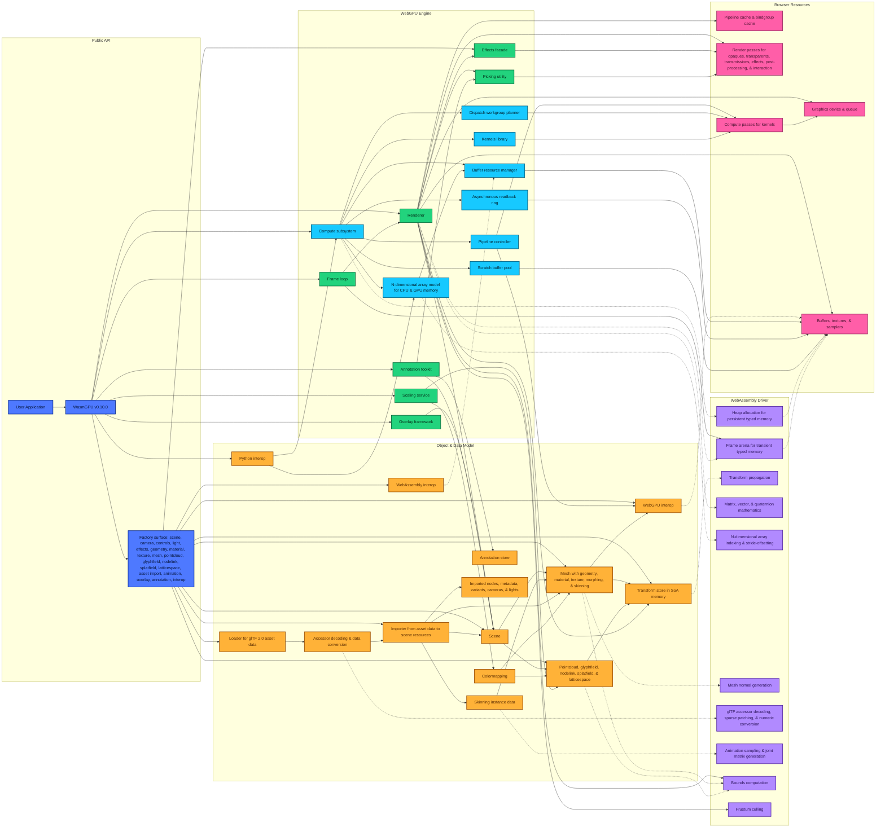

<p align="center">
    <a href="https://zushah.github.io/WasmGPU">
        <picture>
            <source media="(prefers-color-scheme: dark)" srcset="https://raw.githubusercontent.com/Zushah/WasmGPU/main/assets/logo-darkmode.png">
            
        </picture>
    </a>
</p>
<p align="center">
    <strong>WebGPU × WebAssembly rendering and computing engine for scientific workloads in the browser</strong><br>
    <a href="https://github.com/Zushah/WasmGPU/releases/tag/v0.10.0"></a>
    <a href="https://raw.githubusercontent.com/Zushah/WasmGPU/v0.10.0/release/WasmGPU.js"></a>
    <a href="https://www.npmjs.com/package/@zushah/wasmgpu"></a>
    <a href="https://www.jsdelivr.com/package/gh/Zushah/WasmGPU"></a>
    <a href="https://github.com/Zushah/WasmGPU/blob/main/LICENSE.md"></a><br>
    <a href="https://zushah.github.io/WasmGPU">https://zushah.github.io/WasmGPU</a><br>
</p><br>

## About

* ⚙️ WebGPU engine in TypeScript.
    - 🌐 **Scene & assets**: Meshes, pointclouds, glyphfields, nodelinks, splatfields, latticespaces, data materials, lights, cameras, glTF 2.0 assets with support for over a dozen extensions, mipmapped texture sampling, transparency including transmission rendering, animations, 4- or 8-influence skinning, and rich built-in geometry including cartesian and parametric curves and surfaces for mathematics.
    - 🖼️ **Rendering architecture**: WebAssembly-powered frustum culling, previous-frame occlusion culling, opaque draw batching with automatic instanced rendering, GPU sorting for order-dependent scientific primitives, directional shadow mapping, optional subpixel morphological anti-aliasing, configurable canvas format selection, and GPU ID-pass picking across meshes and scientific primitives for individual or regional queries with typed results.
    - 🧭 **Interaction, overlays, & diagnostics**: Orbit, trackball, and fly controls for orthographic and perspective cameras with bounds-based scene framing and inspection views, plus a composable overlay and annotation toolkit with configurable axis triads, annotated grids, adaptive legends, markers, probes, and measurements.
    - 🧮 **Compute & interop**: Compute subsystem with reusable pipelines and buffers, an extensive kernels library spanning parallel primitives, typed vector and matrix arithmetic, sorting, scaling, statistics, and linear algebra, a CPU & GPU ndarray abstraction, asynchronous readback utilities, a unified scale-transform model shared across rendering and computing workflows, declarative WebGPU bindings, direct uploads from external WebAssembly memory, and Python-in-the-browser interoperability.

* 🦀 WebAssembly driver in Rust.
    - 🧱 **Data layout & transforms**: Transforms stored in structure-of-arrays memory with per-index dirty tracking and partial local or world propagation plus model and normal matrix packing, alongside 32-bit and 64-bit vector, quaternion, and matrix floating point math.
    - 🎞️ **Animation & asset hot paths**: Animation sampling and joint-matrix generation executed in WebAssembly together with glTF accessor deinterleaving, sparse patch application, numeric conversion, richer import-side data preparation, and mesh normal generation.
    - 👁️ **Bounds, culling, & visibility**: World-space bounds computation for geometry, pointclouds, glyphfields, nodelinks, splatfields, and latticespaces together with frustum plane extraction, sphere-frustum culling kernels, and CPU-side support for render-only occlusion filtering.
    - 🔗 **Array semantics & zero-copy staging**: Ndarray indexing utilities for explicit shape-and-stride byte-offset math plus uniforms and instance data staged as zero-copy views into WebAssembly memory with scoped ABI borrowing, alias-safe fixed-width math operands, explicit typed-slice handles, and refreshable views over external WebAssembly memories.
    - ⚡ **Performance envelope**: Transient work uses a frame arena while persistent allocations use reclaimable heap arenas with deterministic owning-object disposal, and builds are optimized through LLVM, Binaryen, and SIMD128 for higher throughput.

## Architecture Diagram

The diagram below reflects the implemented architecture of WasmGPU v0.10.0.

Solid arrows indicate creation, ownership, stored references, or call direction. Dashed arrows indicate data movement through WebAssembly memory or WebGPU resources.

Click [here](https://mermaid.live/view#pako:eNqVWFtz4sYS_itTStU-jV0gbOwlVamSQXgpm0sBDnXOcR4GMYBi3TIzsk229r-ne3RBzEBy4odEfOrp6cvXF-13J0g33Ok52yj9CPZMKPI8fxWvCYE_ma93gmV74s1G_3t1Zvk6CgP88er8VsngnzebwesXyQXxsgxkmArTxBDyJ48gtGIyfpy9kPfWdbt13TJkhl4fZIYsUKk4wPViywLeIzLgCackYDEXDP6fJkqkkaQkCnd7RQnfbnmg4PeOpzFX4kBJzBQXIYsoUfxT5QKOx1zuKcnSMFFBlOYbEI8O2X4b8gieEwhDFCZvlMgsYqpE4UmFAZcZ2EEJk5IrEsZZKuBWloSxdpSS9J2LiB0QS1JVgnAPF2nWcJEnG3y0wruCiGBs-BpD4ye7MOFGZJ6nU4zxUEAMSJSeqMW_uT8ZwPs5XMEFF2bsh0N46RdhIhBUtjEvWPS9Zx-EFgGDMOwIJPMdPDekpr_6cxCaFv6SLZrzkYo3kxCTyRTEvDoaRKVp9BYqQ2426j8hscLgDe_MVRiF6mAI9adjdL2fxlmuOEZNHqTisSn28IJOPuTgpSCCyzQXAQciJGxnBaQ_G830xRkmnVeUimzBwWgBgoMQKKCCPUFndyLNMwIsSRJb_kkH6ImLhEcSCLoWTFge6VxNrjZhzBMJ4WERYUJAQGNkIdmmAix8IV8I8iHmcWqrmPseKvHkIQn2Ik3SXILTbLNmwRsREE3zwKI_1-kV2o91EaYM0vJ_EHTgLT1M-_p3IBCYNWCKkTHaarFooi_hFoGXi-V0jgRbCpZI8DAmEqqcQ5mQReqd93LsL77BkTFULvkI1f4fCjwV2R48p2ChBEIldhRmj2jf7F_1gC8nXcAM69gryBmBRyzL7CsXTyMdk9Ig8FcqlgAzNxBEs26qIDUqR0fJlHue6uw_p1DIQvNlFy2HxL1ulU3qnPKBj93VC8ATCSc2HFo_WvRFS2MNQFlLu3N7I12AI9338DqRxo1roLaLDl0XnTQVjH3Nn1LDRgdaYkdWDDVQ8s4glwm28KLJSx127O6mrsfRZHnslXaPxb9VLeOBlfE6OlwQnP2nkJwd1B5C_S86trcYGzcMRPhutYPVN1_z4xtnGWFRlBajUWcsw2BDI0sUUYcMonK2BFbDOYSvbv1M8ITp4wrrKPyn08u5N1mcVF0GHrLduQm9GntLXW5MifATksJxDmMm_six2hK0HOpuz3HuBWZmVhe7WghD6bNgmgTVG36VbrdAH2VXy2oynY-rkk-wpiIoeuizZw1-fF5iz9fcZyavsYqZkJzozl32hSQHesESc5HsK28yGusKLKc7kSzOosL637FxYAggPn9j1sP0ZTLAqD-kebKRcBmOrrOi_ZfnZ53cXKo8JkEeRadBucTAYmV4EOkHrl3zC5U38H8FqUc8AQmD0OBM1wnludXKvP43_2QosmCPwmvIXzHzNGJtHot67Mq6G-sC1pED1Dwx8xaLelmB9EAJSc1pYCZYhlqQrhmSXVW_4lBiumRj3ctSqa6Az5j4Mr-6hGF_tEPdL2-t9ojGtW_FtL4c9SAC4QHfQr8Tb-so52QbRlHvpxv_7utwSIHU6Rvv_dR6cB_uq59XH-FG7Xtu9kkDnA7wutu-7Qx-tpTuBOdJqdF1B527wVGj1x10-pc13nTabc_WqDtnw872Xf_Eztatf9-6rNV1bzodW-uBQwP7KFUOhw9u575W-dW7GbQuq7z13H6rZavMcgEMKVU-tO-9hpVwZuh1L6p0_Xb31j-jEgZ4beOt7zVtdP2ue1HhzQDS4_5s5R0_byh8vVD4OqkJcHqvXs8p7uAUVm2qd2mKuzLFTZjimltk2TiGqy3FxZXiQkpx2aS4QVLYEKle8Sjubcd8Gudh3aLFYkVxVaKw3lDcSCguHbTYJqheFihOf4qTnOppTHGOUhyUVA_BMrmGfj2-aDGCaDFLqJ4SFJo91b2a6iZMddukZeejuq2VyTVUQkeiutNAuBZUtwKqS1Mn7iT6EHdydfULfjlWEDxqCFJhQpgCE8OMmBjG3MR0wkwQ82dimE4T0_GrQORIoXFiQkWiTBT4YkKYShODzJqQzqsFjo7eVdjjGftWJVbhYK91d4U17sbXZ5wBiTMoktBSqq0uTAVG1ig8W_bjsxnMGjvRWQvCjRao-V6hWB3W-RpseKopURAG3tpoKVq9QPZZlKvBooIqGEU0DLVgYbo2LBRqxcawaiy0wSd4_BtBbEoW2Ih0jZ0mtYZ1jdto0QFqYmDns2zAyrISC5VVpOvkuhpumluD5fk6j9My5dhSbRBarA1Cy7XBp2PlH8FjXo8YtmgbhZZdg3CpVYR1FTVBfCZX16fJRkdMAtQq-82YoiNn0Kcy0qdoxbVmmNAV6yocPtb12Kwb9K1eFDwpXChmxam_GseRcQY2WIPt5AxedAn9AofOaZ_RME6hEy-LSwenPL2-UJIax_F2mlIN4ySs4FWdqmYEizlqjpgGejRDa7OSXZhUww51dvCx5PSUyDl14LslZvjT-Y7irw5-h8Ey3oNH3EpendfkB5zJWPLfNI2rY7C37_ZOb8siCb_yDL63-SBk8BFxFNF7eB--VZTTu9UanN5359Ppubfd69vOXat70-1023fd1h11Dk7vqnUNkHv3tdNttTqu63Zuuz-o86e-tn3darvtr3dwtnV_D_-9pw7fhPAlOS7-pVn_g_OPvwBNMLPe) to interactively view the diagram if it doesn't properly appear below.



## Platform Compatibility

The two tables below reflect the fundamental requirements (as of August 31, 2026) for properly running the latest release of WasmGPU. They have been fact-checked against official online sources from the respective publishers of the web browsers, operating systems, runtimes, and hardware, but they are not a claim that WasmGPU has been tested on all combinations of them.

Browser and driver support naturally changes over time. Therefore, if an entry in the two tables below is inaccurate or misleading, please [open an issue](https://github.com/Zushah/WasmGPU/issues) with as much relevant information as possible, including the web browser, operating system, runtime, hardware devices and drivers, and a minimal reproduction.

### Browser and System Requirements

| Browser | Platform | Status | WebGPU availability |
| :--- | :--- | :---: | :--- |
| Chromium | Windows (AMD64), MacOS, ChromeOS | ✅ | Available by default from Chromium 113 on Windows with a Direct3D 12 adapter, MacOS, and ChromeOS devices with Vulkan support. Use the latest stable browser and current graphics drivers. |
| Chromium | Windows (ARM64) | 🧪 | Disabled by default and available only through an unsafe WebGPU flag. |
| Chromium | Android | ⚠️ | Available from Chromium 121 on Android 12 or newer for supported ARM Mali, Qualcomm Adreno, and Intel GPUs, and from Chromium 139 on Android 16 or newer for supported Imagination GPUs. Samsung Xclipse and other GPU families are not yet generally supported. |
| Chromium | Linux | ⚠️ | Available by default from Chromium 144 on Intel Gen12 or newer GPUs, and from Chromium 147 on NVIDIA driver 535.183.01 or newer under Wayland. Other Linux configurations remain experimental and probably require unsafe browser flags. |
| Firefox | Windows | ✅ | Available by default from Firefox 141. |
| Firefox | MacOS | ⚠️ | Available by default on Apple Silicon from Firefox 145 on MacOS 26 and from Firefox 147 across supported MacOS versions. Other MacOS configurations remain limited to Firefox Nightly. |
| Firefox | Linux | 🧪 | Enabled in Firefox Nightly, but not in stable or beta releases. |
| Firefox | Android | 🧪 | Not enabled by default in Firefox release or beta builds. Firefox 143.0.3 and newer can expose WebGPU through the `dom.webgpu.enabled` advanced preference when the device passes Firefox's WebGPU blocklist. |
| Safari | MacOS 26, iOS 26, iPadOS 26 | ✅ | Available by default from Safari 26 through WebKit's Metal implementation. |
| Other browsers and embedded webviews | Any | ⚠️ | Compatible only when the runtime exposes WebGPU, WebAssembly, and the required browser APIs. Engine support does not guarantee that a particular browser distribution or webview enables WebGPU. |

### Runtime and Hardware Requirements

| Requirement | Compatibility rule |
| :--- | :--- |
| **Secure context** | WebGPU is exposed only in a secure context, so deploy through HTTPS or use a browser-recognized local development origin such as `localhost`, `127.0.0.1`, or a `*.localhost` subdomain. |
| **Browser environment** | Rendering requires a main-thread browser page with `navigator.gpu`, `window`, and a DOM-backed `HTMLCanvasElement`. Offscreen worker rendering is not currently a supported WasmGPU entry point. |
| **WebGPU adapter** | A core WebGPU adapter must be available. WasmGPU does not request WebGPU compatibility mode. The `timestamp-query` and `primitive-index` features are requested only when advertised, as GPU timing needs the former, while mesh-element picking needs the latter. |
| **WebAssembly** | The distributed WebAssembly driver requires WebAssembly with SIMD128 support. Shared WebAssembly memory and cross-origin isolation are not required by the default build. |
| **Graphics card and driver** | Compatibility ultimately depends on the browser accepting the installed graphics card and driver. Unsupported, outdated, remotely virtualized, or browser-blocklisted adapters may cause adapter acquisition to fail even on an operating system marked as available above. |
| **Workload limits** | The adapter must satisfy the buffer and binding limits requested by the application. Large pointcloud, glyphfield, nodelink, splatfield, latticespace, texture, or compute workloads can exceed the resources of otherwise compatible devices. |

## Getting Started

Examples:
1. [`./examples/benchmark.html`](https://zushah.github.io/WasmGPU/examples/benchmark.html) to see how the performance of WasmGPU compares to Three.js and Babylon.js for both rendering and computing.
2. [`./examples/esm.html`](https://zushah.github.io/WasmGPU/examples/esm.html) to see how to get started with the ESM build.
3. [`./examples/iife.html`](https://zushah.github.io/WasmGPU/examples/iife.html) to see how to get started with the IIFE build.
4. [`./examples/gltf.html`](https://zushah.github.io/WasmGPU/examples/gltf.html) to see how a glTF model of a T-rex can be loaded, imported, animated, as well as shadow-casted.
5. [`./examples/controls.html`](https://zushah.github.io/WasmGPU/examples/controls.html) to see how the camera controls and navigation functionalities work.
6. [`./examples/picking.html`](https://zushah.github.io/WasmGPU/examples/picking.html) to see how the picking, probing, and selecting utility works.
7. [`./examples/scaling.html`](https://zushah.github.io/WasmGPU/examples/scaling.html) to see how the scaling service and colormapping works.
8. [`./examples/overlay.html`](https://zushah.github.io/WasmGPU/examples/overlay.html) to see how the overlay framework and annotation toolkit works.
9. [`./examples/mandelbulb.html`](https://zushah.github.io/WasmGPU/examples/mandelbulb.html) to see how the compute subsystem can be used to render a Mandelbulb fractal.
10. [`./examples/galaxy.html`](https://zushah.github.io/WasmGPU/examples/galaxy.html) to see how a pointcloud can be used with Python intero via Pyodide and the compute subsystem to render a realistic galaxy.
11. [`./examples/fluid.html`](https://zushah.github.io/WasmGPU/examples/fluid.html) to see how a glyphfield and a pointcloud can be used with Python interop, the compute subsystem, navigation, selection, and overlay features to render a fluid dynamics demo.
12. [`./examples/graphing.html`](https://zushah.github.io/WasmGPU/examples/graphing.html) to see how the mathematical function primitives and data materials can be used with Python interop, navigation, selection, and overlay features to render for a 3D graphing calculator.
13. [`./examples/protein.html`](https://zushah.github.io/WasmGPU/examples/protein.html) to see how a nodelink can be used with Python interop, navigation, selection, colormap, and overlay features to render a visualization of a protein structure (hemoglobin) from the Protein Data Bank.
14. [`./examples/terrain.html`](https://zushah.github.io/WasmGPU/examples/terrain.html) to see how a Gaussian splatfield can be used with a custom material and fly controls to render a procedurally-generated terrain.
15. [`./examples/lego.html`](https://zushah.github.io/WasmGPU/examples/lego.html) to see how a Gaussian splatfield glTF model of a lego set can be loaded and imported.
16. [`./examples/quantum.html`](https://zushah.github.io/WasmGPU/examples/quantum.html) to see how a couple of latticespaces can be used with picking to create a quantum orbitals visualizer.

Here's a super basic example to render a cube:
```js
// Setup
import { WasmGPU } from "@zushah/wasmgpu"; // or from "https://cdn.jsdelivr.net/gh/Zushah/WasmGPU@0.10.0/release/WasmGPU.min.js"
const canvas = document.querySelector("canvas");
const wgpu = await WasmGPU.create(canvas, { antialias: true});

// Scene, camera, and controls
const scene = wgpu.createScene([0.05, 0.05, 0.1]);
const camera = wgpu.createCamera.perspective({
    fov: 60,
    near: 0.1,
    far: 1000
});
camera.transform.setPosition(-2, 2, -2);
camera.lookAt(0, 0, 0);
const controls = wgpu.createControls.orbit(camera, canvas);

// Light
scene.addLight(wgpu.createLight.directional({
    direction: [1, -1, -1],
    color: [1, 1, 1],
    intensity: 1.5
}));

// Cube
const cube = wgpu.createMesh(
    wgpu.geometry.box(1, 1, 1),
    wgpu.material.standard({
        color: [1, 0, 0],
        metallic: 0.7
    })
);
scene.add(cube);

// Render
wgpu.run((dt, time) => {
    controls.update(dt);
    wgpu.render(scene, camera);
});
```

Using the IIFE bundle instead of the ESM bundle is exactly the same as above, except you must use an HTML `script` tag instead of a JavaScript `import` statement:
```html
<script src="https://cdn.jsdelivr.net/gh/Zushah/WasmGPU@0.10.0/release/WasmGPU.iife.min.js"></script>
```

To get started with the comprehensive [documentation](https://zushah.github.io/WasmGPU/docs/), consider visiting the pages for these fundamentals first:
- [`WasmGPU.create`](https://zushah.github.io/WasmGPU/docs/render/wasmgpu-create/)
- [`WasmGPU.compute.createPipeline`](https://zushah.github.io/WasmGPU/docs/compute/wasmgpu-compute-createpipeline/)
- [`WasmGPU.createMesh`](https://zushah.github.io/WasmGPU/docs/objects/wasmgpu-createmesh/)
- [`WasmGPU.createCamera.perspective`](https://zushah.github.io/WasmGPU/docs/world/wasmgpu-createcamera-perspective/)
- [`WasmGPU.createControls.orbit`](https://zushah.github.io/WasmGPU/docs/interact/wasmgpu-createcontrols-orbit/)
- [`WasmGPU.webassembly`](https://zushah.github.io/WasmGPU/docs/interop/wasmgpu-webassembly/)
- [`WasmGPU.python`](https://zushah.github.io/WasmGPU/docs/interop/wasmgpu-python/)
- [`WasmGPU.math`](https://zushah.github.io/WasmGPU/docs/math/wasmgpu-math/)

## Contributing

Asking questions, reporting bugs, suggesting features, and contributing code is very welcome. The guidelines can be found [here](https://github.com/Zushah/WasmGPU/blob/main/CONTRIBUTING.md).

## Acknowledgements

- [@Zushah](https://github.com/Zushah): main author.
- [@ZacharyVarley](https://github.com/ZacharyVarley): LU factor and solve kernels ([#3](https://github.com/Zushah/WasmGPU/pull/3)) in [`v0.8.0`](https://github.com/Zushah/WasmGPU/releases/tag/v0.8.0).
- [@L1quidH2O](https://github.com/L1quidH2O): optimization of pointcloud shader ([#1](https://github.com/Zushah/WasmGPU/pull/1)) in [`v0.7.0`](https://github.com/Zushah/WasmGPU/releases/tag/v0.7.0).

## License

WasmGPU is available under the [Mozilla Public License 2.0](https://github.com/Zushah/WasmGPU/blob/main/LICENSE.md).
