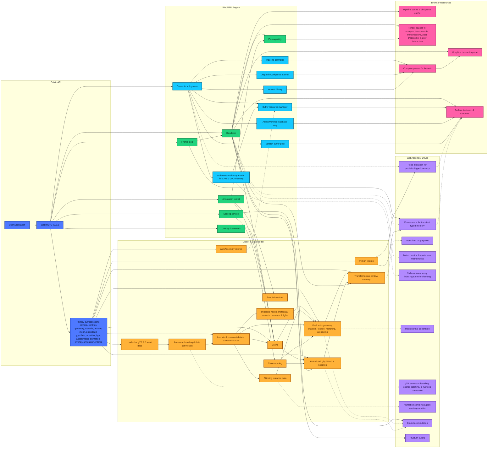

<p align="center">
    <a href="https://zushah.github.io/WasmGPU">
        <picture>
            <source media="(prefers-color-scheme: dark)" srcset="https://raw.githubusercontent.com/Zushah/WasmGPU/main/assets/logo-darkmode.png">
            
        </picture>
    </a>
</p>
<p align="center">
    <a href="https://www.github.com/Zushah/WasmGPU/releases/tag/v0.8.0"></a>
    <a href="https://raw.githubusercontent.com/Zushah/WasmGPU/v0.8.0/dist/WasmGPU.js"></a>
    <a href="https://www.npmjs.com/package/@zushah/wasmgpu"></a>
    <a href="https://www.jsdelivr.com/package/gh/Zushah/WasmGPU"></a>
    <a href="https://www.github.com/Zushah/WasmGPU/blob/main/LICENSE.md"></a>
</p><br>

## About

- 🔥 WebGPU × WebAssembly rendering and computing engine for scientific workloads in the browser.
- 🚀 Latest release: [**`v0.8.0`**](https://www.github.com/Zushah/WasmGPU/releases/tag/v0.8.0).
- 💡 Website: [https://zushah.github.io/WasmGPU](https://zushah.github.io/WasmGPU).
- ⚙️ WebGPU engine written in TypeScript, spanning **scene & assets** (meshes, pointclouds, glyphfields, nodelinks, data materials, lights, cameras, glTF 2.0 assets with over a dozen extensions, metadata, and animation-extension coverage, mipmapped texture sampling, transparency including transmission rendering, animations, 4- or 8-influence skinning, and rich built-in geometry including cartesian and parametric curves and surfaces for mathematics); **rendering architecture** (WebAssembly-powered frustum culling, previous-frame occlusion culling, opaque draw batching with automatic instanced rendering, optional subpixel morphological anti-aliasing, configurable canvas format selection, and GPU ID-pass picking for both single-hit queries and rectangular or lasso region queries with typed results); **interaction, overlays, & diagnostics** (orbit/trackball orthographic/perspective camera navigation with bounds-based scene framing, inspection views, and a composable overlay and annotation toolkit with triads, grids, legends, markers, probes, and measurements); and **compute & interop** (a first-class compute subsystem with reusable pipelines and buffers, an extensive kernels library, an ndarray abstraction, asynchronous readback utilities, a unified scale-transform model shared across rendering and computing workflows, external WebAssembly module interoperability, and Python-in-the-browser interoperability).
- 🦀 WebAssembly driver written in Rust, spanning **data layout & transforms** (transforms stored in SoA memory with per-index dirty tracking and partial local or world propagation plus model and normal matrix packing); **animation & asset hot paths** (animation sampling and joint-matrix generation executed in WebAssembly together with glTF accessor deinterleaving, sparse patch application, numeric conversion, richer import-side data preparation, and mesh normal generation); **bounds, culling, & visibility** (world-space bounds computation for geometry, pointclouds, glyphfields, and nodelinks together with frustum plane extraction, sphere-frustum culling kernels, and CPU-side support for render-only occlusion filtering); **array semantics & zero-copy staging** (ndarray indexing utilities for explicit shape-and-stride byte-offset math plus uniforms and instance data staged as zero-copy views into WebAssembly memory with explicit typed-slice handles and module-facing views for external WebAssembly interoperability); and **performance envelope** (hot-path allocations avoided via cached pipelines and bind-group layouts plus a frame arena and user heap arenas, with builds optimized via LLVM and Binaryen and SIMD128 enabled for even higher throughput).

## Architecture Diagram

The diagram below reflects the implemented architecture of WasmGPU v0.8.0.

Solid arrows indicate creation, ownership, stored references, or call direction. Dashed arrows indicate data movement through WebAssembly memory or WebGPU resources.

Click [here](https://mermaid.live/view#pako:eNqNWFlv4zgS_iuEBugnJvAVXwMsIF9pI_EB25mgd7MPtEzbmuhakkriafR_3ypSVkQ6nl2_xPpULFbVV5fz0wvSHff63j5K34MjE4o8rl4SAh-Zbw-CZUfiL6f_evGW-TYKA3x48f5tJPDjL5fw8klyQfwsAwmmwjSxRMbzexB5ZjK-Xz6Rt9pt97ZmCUz8IQhMWKBScYJ7xZ4FvE9kwBNOScBiLhj8TRMl0khScuBpzJU4URIzxUXIIkoU_1C5APGYyyMlWRomKojSfAfi0Sk77kMewfcEvI3C5JWSKDwcFSVMSq5IGGepwKckjLUDlKRvXETshFiSqgIEpVykWWk9T3YviROuZ_AS_eVbdHecHMKEW-4-LhYYs4kAx0iUVtThZzWej-DtClRzwYX1bj30H8fwch0wcOJAIOpvYWBrX_wxXoHIwphP9njLeypebdbm8wUI-aVrRKVp9BoqS2o5HT4g82HwirflKoxCdbJEhosZ-jJM4yxXHIMgT1Lx2BYaPE1AaJDv95Amgss0FwEH8hJ2cDwcLqdLfWWGNPEz6ZErNpquQWwUyoyp4EjQwYNI84xkEfDlSj_okDxwkfBIAvNbwYTjhw76_GYXxjyREBAWESYEBDDGjCH7VIBtT-QbQVJjHqeugtXYRxW-PCXBUaRJmktwle22LHglAuJni6-HK02k0PZvTWgyIOFvc2vkb3wkd_snDxQYM2KKkRla6OTJXCvnTuZt1pvFChNoI1giwaeYSKg5DnlN1qn_lV-z8fo7HJhBVZH3UB3_R_GlIjuCrxRsk5A0iev38h4tW16pzm9lfdrBmvkmySKwmGWZq3T9MNX-FheCN1KxBDJsB-Gx8_4cgErm6wjYUo8LzeVjyqAGNfeHaDMhjdta0S8uFY_G2MP8IOBSgvyOQ19FW75pWcxjKEjptkZ_qstnqtsPXiXSuHIFVKXpgmXRSPv4bKzzoTi_0-GT2AMVw_OUvDFgKFHy3EYlBlm3PlvT83S-MU3Lh9vjbXS66HWavh_I3kkdIW7_Vy_01zNH7UiEb059Pn8fa4K_c5YRFkWpGSI68BlGDTpKoog6ZeDiFzn6PFlBJMqWygRPmD6sMM3Dvz-7WfnztVUSGXjFDpdz7Hnmb3QtMCXCD4gtx4GFAf1PjqWQoM1QFEeOMyRwAny1wYTQ6D9MqkhQvOM36X4PGaDcNH-eL1azcy0mWAoRVCM0uy9MvX_cYMvVacvcpKQE2qaQnOjmWZRrkkN-wIC_kqnP_nw604VTTEgiWZxFxu4_sZ7RdYjLVZMGi6f5CCM9SPNkJ-EinBlfCA6fHh81mblUeUyCPIqqofgqz8zIHYj0HReR1ZfFMhr_ATL3KA_kQDBwdGryeG7X_9Affh9bU4gFRxTdAldmzGjEmdvrcsbJsiXqetORAtSWX_rrdTnogQooEKmzFrIPbEIdmJIZprM6P8WhRGokbjhS3UCqIrcFhTk6r8sSVik3rMPivvOorlz4agbjVxEOIhAb8T20I_G6jXJO9mEU9X9rjTu9yYRCwqavvP9bbdAYdM-PN-_hTh37jeyDBtiy4XW7ftcc_e6oPAjOk0JfozFqdkaf-vz2qDm8rq_VrNd9V59uaxUb652hZWPtbtytXdfZaLSaTVfniUM7ei8UTiaDRrNbKuz5rVHtusI7vzGs1VyFWS4gFwqFg3rXr1gIJyZ--6rCxrjevhtfKIRpWdp3N_ar9jXG7cZVda0RkNL43WIa13kK-zqFlbykvHqjXl4p7qhUL6MU102K6yTFbdFwah3ADZHiBkhxt6O4uVFcyCisXFRvTRSXoU_2rNOwyVCztVDcRCjsDxTXAYozn5pxTvW8pjiCKQ5UqscixZFGlz8KCi2teuBQMzaomQBUd3cKbZrqPkt1C6W67dGid1HdmgoKLYXQW6juGhCaNdWlTXXBaXrKGEN0yc3NP_AXkQHgiwYg3DaAYbYRjLmNYGRtRFNiQ8iPjSBZBkGSzbG5DZiI2xiG30aACxvQPDjQ9GzjGUFaHD0_zvEBQ5y7zkh5F766sBHeXmCYII4ybZ8xC3KlwOCbYyl-s-NSIhVdpRDc40A6_wyGueqcLKHSJ02boRTeuZgWMyBmhZMMJWSy2YD4WoOQlw6is9TBIGddBHPXwbC-HagMUIlUGShBXTYuZkqq4A9bh3MvJq7DAiSuiW_lkhL8NK-E9Mki6IuCG-xELgR9yYWgS7nQw7mQPqEzCZ8I9jMXg-5WQHC3HXC8urChdBzvvsAeimBUsTOjnx7h7c4F2FqdK7EtlclhQEMbublFZnQ_rFabRrEpXoAWiViEF6ipLw1jQ63Wpgaxv1b8MVeNqsly-2VyaxRbdjXaGsTebkBsNQb8jBEMhBtb6oxUrtBvzckybuZ9CXrUO8Cy7vWVyDn1YHeOGT56P1H8xcNfAbAg9uErztEX7yX5BWcylvwzTePzMdglD0evv2eRhKc8gx9tfBQyWGo_RfR-OISdWXn9ntbg9X96H_BwW-u06q1OvdbtNLutJvVOXr9x2-v1OnedXq3T63bazUbrF_X-0lfWbnuwN7W6tXq71-i1G-076vFdCL9hZuZ_gPpfgb_-C-Os4DI) to interactively view the diagram if it doesn't properly appear below.



## Architecture Comparison Tables

### 1. Platform and Toolchain
|  | **WebGL / WebGPU** | **Three.js / Babylon.js** | **WasmGPU** |
| :--- | :--- | :--- | :--- |
| **Origin** | 2011 / 2023 | 2010 / 2013 | 2026 |
| **Implementation Language** | JavaScript & C++ | JavaScript / TypeScript | TypeScript & Rust |
| **Application Language** | JavaScript & GLSL / WGSL | JavaScript / TypeScript & GLSL / WGSL | JavaScript / TypeScript & WGSL (& Python via Pyodide) |
| **Buildtime Optimization** | Not available | Transpilation, tree-shaking, minification | Transpilation & LLVM, tree-shaking & Binaryen, minification |
| **Graphics Engine** | WebGL / WebGPU | WebGL-native & WebGPU-adoptive | WebGPU-native |
| **Vectorization** | Not available | Scalar | SIMD128 |
| **API Ergonomics** | Verbose | Streamlined | Streamlined |

### 2. Execution Model and Memory Layout
|  | **WebGL / WebGPU** | **Three.js / Babylon.js** | **WasmGPU** |
| :--- | :--- | :--- | :--- |
| **Scene Graph Memory** | Not available | Object-oriented (AoS) | Data-oriented (SoA) |
| **Math Execution** | JavaScript | JavaScript | WebAssembly |
| **Transform Updates** | Not available | Recursive traversal | Linear iteration |
| **Bounds Computation** | Manual | JavaScript | WebAssembly |
| **View Framing** | Manual | Helper-based fitting | Bounds-based scene/object fitting |
| **Garbage Collection** | Manual & low/high pressure via JavaScript engine | Automatic & high pressure via JavaScript engine | Automatic & low pressure via WebAssembly driver |
| **Render Loop** | Run by JavaScript | Run by JavaScript | Run by JavaScript & WebAssembly |

### 3. Rendering Pipeline Infrastructure
|  | **WebGL / WebGPU** | **Three.js / Babylon.js** | **WasmGPU** |
| :--- | :--- | :--- | :--- |
| **Uniform Uploads** | Manual packing | Extraction & packing | Zero-copy views & no packing |
| **Render State Caching** | Manual | State filtering | Pipeline caching |
| **Instancing** | Manual | Manual | Automatic |
| **Visibility Culling** | Not available | Frustum culling in JavaScript | Frustum & occlusion culling in WebAssembly |
| **Picking** | Manual GPU / CPU picking | Often CPU-centered | GPU ID-pass with typed hits |
| **Skinning** | Not available | Data textures | Storage buffers |
| **Anti-aliasing** | Not available | MSAA | SMAA |
| **Textures** | Manual | Managed objects | Managed objects |
| **Animation System** | Not available | Executed in JavaScript | Executed in WebAssembly |
| **Asset Importing** | Not available | glTF 2.0 | glTF 2.0 |
| **Camera Controls** | Not available | Built-in | Built-in |

### 4. Compute Workloads and Scientific Visualizations
|  | **WebGL / WebGPU** | **Three.js / Babylon.js** | **WasmGPU** |
| :--- | :--- | :--- | :--- |
| **GPGPU** | Manual, low-level, high-boilerplate | Integrated, renderer-adjacent, framework-specific | Automated, kernel-driven, compute-optimized |
| **Ndarray Abstraction** | Not available | Not available | CPU & GPU ndarrays |
| **GPU Readback** | Manual | Manual | Async readback ring |
| **Python Interoperability** | Not available | Not available | With Pyodide |
| **Scientific Primitives** | Manual | Manual | Pointclouds, glyphfields, & nodelinks |
| **Mathematical Geometry** | Manual | Manual | Cartesian & parametric curves & surfaces |
| **Scaling Statistics** | Manual | Manual | Min/max & percentile analysis |
| **Colormap Support** | Manual | Manual | Built-ins & custom |
| **Data-driven Materials** | Manual | Manual | Data material |
| **Scientific Overlays** | Manual | Manual | Grids, triads, & legends |
| **Annotation & Measurement** | Manual | Manual | Markers, probes, distance, & angle toolkit |

## Getting Started

Examples:
1. [`./examples/benchmark.html`](https://zushah.github.io/WasmGPU/examples/benchmark.html) to see how the performance of WasmGPU compares to Three.js and Babylon.js for both rendering and computing.
2. [`./examples/esm.html`](https://zushah.github.io/WasmGPU/examples/esm.html) to see how to get started with the ESM build.
3. [`./examples/iife.html`](https://zushah.github.io/WasmGPU/examples/iife.html) to see how to get started with the IIFE build.
4. [`./examples/gltf.html`](https://zushah.github.io/WasmGPU/examples/gltf.html) to see how a glTF model of a chessboard can be loaded and imported.
5. [`./examples/controls.html`](https://zushah.github.io/WasmGPU/examples/controls.html) to see how the camera controls and navigation functionalities work.
6. [`./examples/picking.html`](https://zushah.github.io/WasmGPU/examples/picking.html) to see how the picking, probing, and selecting utility works.
7. [`./examples/scaling.html`](https://zushah.github.io/WasmGPU/examples/scaling.html) to see how the scaling service and colormapping works.
8. [`./examples/overlay.html`](https://zushah.github.io/WasmGPU/examples/overlay.html) to see how the overlay framework and annotation toolkit works.
9. [`./examples/mandelbulb.html`](https://zushah.github.io/WasmGPU/examples/mandelbulb.html) to see how the compute subsystem can be used to render a Mandelbulb fractal.
10. [`./examples/galaxy.html`](https://zushah.github.io/WasmGPU/examples/galaxy.html) to see how a point cloud can be used with Python intero via Pyodide and the compute subsystem to render a realistic galaxy.
11. [`./examples/fluid.html`](https://zushah.github.io/WasmGPU/examples/fluid.html) to see how a glyph field and a point cloud can be used with Python interop, the compute subsystem, navigation, selection, and overlay features to render a fluid dynamics demo.
12. [`./examples/graphing.html`](https://zushah.github.io/WasmGPU/examples/graphing.html) to see how the mathematical function primitives and data materials can be used with Python interop, navigation, selection, and overlay features to render for a 3D graphing calculator.
13. [`./examples/protein.html`](https://zushah.github.io/WasmGPU/examples/protein.html) to see how a point cloud can be used with Python interop, navigation, selection, colormap, and overlay features to render a visualization of a protein structure (hemoglobin) from the Protein Data Bank.

Super basic example to render a cube:
```js
// Setup
import { WasmGPU } from "@zushah/wasmgpu";
const canvas = document.querySelector("canvas");
const wgpu = await WasmGPU.create(canvas, { antialias: true});

// Scene, camera, and controls
const scene = wgpu.createScene([0.05, 0.05, 0.1]);
const camera = wgpu.createCamera.perspective({
    fov: 60,
    near: 0.1,
    far: 1000
});
camera.transform.setPosition(-2, 2, -2);
camera.lookAt(0, 0, 0);
const controls = wgpu.createControls.orbit(camera, canvas);

// Light
scene.addLight(wgpu.createLight.directional({
    direction: [1, -1, -1],
    color: [1, 1, 1],
    intensity: 1.5
}));

// Cube
const cube = wgpu.createMesh(
    wgpu.geometry.box(1, 1, 1),
    wgpu.material.standard({
        color: [1, 0, 0],
        metallic: 0.7
    })
);
scene.add(cube);

// Render
wgpu.run((dt, time) => {
    controls.update(dt);
    wgpu.render(scene, camera);
});
```

Using the IIFE bundle instead of the ESM bundle is exactly the same as above, except you must use an HTML `script` tag instead of a JavaScript `import` statement:
```html
<script src="https://cdn.jsdelivr.net/gh/Zushah/WasmGPU@0.8.0/dist/WasmGPU.iife.min.js"></script>
```

To get started with the comprehensive [documentation](https://zushah.github.io/WasmGPU/docs/), consider visiting the pages for these fundamentals first:
- [`WasmGPU.create`](https://zushah.github.io/WasmGPU/docs/render/wasmgpu-create/)
- [`WasmGPU.compute.createPipeline`](https://zushah.github.io/WasmGPU/docs/compute/wasmgpu-compute-createpipeline/)
- [`WasmGPU.createMesh`](https://zushah.github.io/WasmGPU/docs/objects/wasmgpu-createmesh/)
- [`WasmGPU.createCamera.perspective`](https://zushah.github.io/WasmGPU/docs/world/wasmgpu-createcamera-perspective/)
- [`WasmGPU.createControls.orbit`](https://zushah.github.io/WasmGPU/docs/interact/wasmgpu-createcontrols-orbit/)
- [`WasmGPU.webassembly`](https://zushah.github.io/WasmGPU/docs/interop/wasmgpu-webassembly/)
- [`WasmGPU.python`](https://zushah.github.io/WasmGPU/docs/interop/wasmgpu-python/)
- [`WasmGPU.math`](https://zushah.github.io/WasmGPU/docs/math/wasmgpu-math/)

## Contributing

Asking questions, reporting bugs, suggesting features, and contributing code is very welcome. The guidelines can be found [here](https://www.github.com/Zushah/WasmGPU/blob/main/CONTRIBUTING.md).

## Acknowledgements

- [@Zushah](https://www.github.com/Zushah): main author.
- [@ZacharyVarley](https://www.github.com/ZacharyVarley): LU factor and solve kernels ([#3](https://www.github.com/Zushah/WasmGPU/pull/3)).
- [@L1quidH2O](https://www.github.com/L1quidH2O): optimization of pointcloud shader ([#1](https://www.github.com/Zushah/WasmGPU/pull/1)).

## License

WasmGPU is available under the [Mozilla Public License 2.0](https://www.github.com/Zushah/WasmGPU/blob/main/LICENSE.md).
