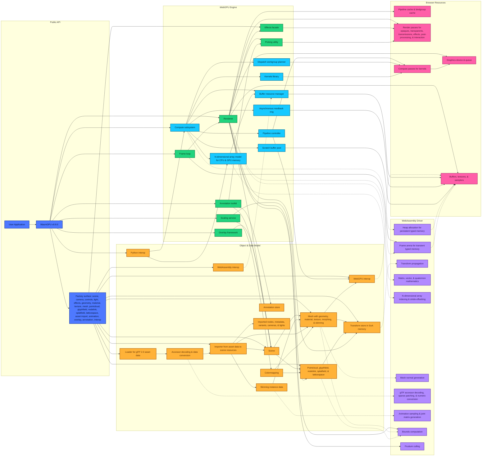

# WasmGPU v0.9.0 Architecture

## Diagram

The diagram below reflects the implemented architecture of WasmGPU v0.9.0.

Solid arrows indicate creation, ownership, stored references, or call direction. Dashed arrows indicate data movement through WebAssembly memory or WebGPU resources.

## Render

Rendering is coordinated by one renderer that owns the WebGPU adapter, device, queue, canvas context, shared bind-group layouts, fallback resources, pipeline caches, shader caches, and size-dependent render targets. At the start of a frame, it updates camera and hierarchy matrices, stages camera, lighting, model, and normal records through the WebAssembly frame arena, and gathers separate draw lists for meshes and each scientific object family. Rust routines provide batched transform, bounds, and frustum work, while an optional hierarchy derived from a previous frame can conservatively remove hidden opaque objects without blocking the current frame. The renderer then prepares directional-shadow layers, reuses compatible opaque instance runs, sorts transparent splats and lattice cells in private GPU paths, and encodes opaque, transmission, transparent, and optional SMAA passes. Picking uses related preparation machinery but separate identifier targets, and asynchronous timing or occlusion readbacks are scheduled after command encoding so they do not become synchronous frame dependencies.

## Compute

Each WasmGPU instance constructs a compute service around the same WebGPU device and queue used by rendering. That service is divided into resource wrappers for storage and uniform buffers, a pipeline layer for arbitrary WGSL and bind groups, workgroup and dispatch helpers, a built-in kernel library, pooled scratch storage, and reusable asynchronous readback slots. Command encoding remains explicit: individual or batched dispatches receive pipelines, bindings, and one-, two-, or three-dimensional workgroup counts before being submitted to the shared queue. The ndarray layer sits above those resources and preserves shape, stride, offset, numeric type, and residency metadata across WebAssembly-backed CPU arrays and owned or borrowed GPU buffers. Upload and readback operations bridge the two residences without pretending that GPU storage is WebAssembly memory, while the kernel and scaling layers reuse scratch buffers and readback infrastructure for multi-stage algorithms. An optional blitter forms a separate path from RGBA storage buffers to browser canvases.

## World

The world architecture uses a scene as the registration container for meshes, five scientific object families, and lights, while spatial hierarchy is carried by transform objects rather than by nested scene nodes. Every transform has JavaScript-facing position, rotation, scale, and parent-child state, but its indexed local and world matrices live in a global structure-of-arrays store in WebAssembly memory. Mutations mark entries dirty, and the store sends ordered hierarchy batches to Rust before rendering. Cameras participate in the same transform system and cache view and projection matrices; perspective and orthographic subclasses supply the projection policy without creating a second scene graph. Ambient, directional, point, and spot lights remain lightweight world objects whose state is packed by the renderer, with a bounded number of local lights entering each frame. Navigation controls attach browser input to camera transforms and notify overlays, while the runtime frame loop resets transient arena memory before invoking application work and rendering.

## Objects

Scene objects are data carriers with distinct ownership rules and renderer paths. A mesh references separately reference-counted geometry and material objects, adds a transform, and may attach skin or morph runtime state. Pointclouds, glyphfields, nodelinks, splatfields, and latticespaces each own a transform, bounds, uniforms, bind-group state, and any GPU buffers created from CPU or WebAssembly input. Caller-supplied GPU buffers and external WebAssembly views are borrowed unless ownership is explicitly transferred; refreshing a WebAssembly source copies its active records into an object-owned GPU buffer. CPU records are retained only when requested or required by a source path, which determines whether detailed pick attributes and computed bounds are available. The renderer keeps separate drawing and picking implementations for each family, including private depth-sort resources for transparent splats and three-dimensional lattices. Scaling descriptors, colormaps, masks, procedural geometry choices, and source revisions remain on the objects so cached renderer and scaling work can be invalidated without centralizing all data in the scene.

## Interact

Interaction spans a GPU selection path and a DOM overlay path that share camera and object state without sharing ownership. Picking renders object and element identifiers into dedicated offscreen textures, reads back a pixel or selected region, and serializes requests so reusable GPU resources are not raced. The engine translates renderer hits into public results and, when retained CPU records exist, appends object-specific scalar, vector, graph, splat, or lattice attributes. Rectangle and lasso queries feed the same selection model as point queries. Separately, the overlay system creates a managed DOM root beside the canvas, registers layers through system-owned wrappers, observes viewport changes, and invalidates projection work when cameras, controls, layouts, scales, colormaps, or interactions change. Axis, grid, and legend layers plug into that lifecycle. The annotation toolkit owns its own record store and connects pick results to scene marker objects and pooled label elements, keeping annotation data outside the scene’s object arrays.

## Interop

Interoperability is organized as three boundary layers around the main TypeScript API. The WebAssembly layer wraps an instance or export record, resolves functions and globals used as pointer or length sources, and creates typed views that can be refreshed when linear memory grows; those views remain borrowed and are never silently freed by scene objects. The Python layer accepts Pyodide proxies and NumPy-compatible array metadata, validates numeric type, shape, strides, byte range, and contiguity, and then copies or exposes data through CPU and GPU ndarray abstractions according to the requested destination. The WebGPU layer is deliberately declarative: it normalizes resource layouts and binding entries for buffers, samplers, textures, and external textures, while compute pipelines and custom materials remain responsible for execution. External GPU buffers use explicit ownership flags, and ESM or script-bundle entry points expose the same runtime around the Rust-generated WebAssembly driver rather than maintaining separate language-specific engines.

## Math

The math architecture is split between small TypeScript facades and comprehensive Rust files. Vector, quaternion, and matrix modules allocate typed blocks in WebAssembly memory, call precision-specific Rust functions, and copy scalar or fixed-size results back through stable JavaScript wrappers; both single- and double-precision CPU paths are represented. Larger engine subsystems use the same driver for operations where packed memory and batching matter more than object-oriented interfaces. The global transform store supplies structure-of-arrays components and matrices to hierarchy propagation routines, geometry delegates normal and bounds generation, animation delegates joint-matrix assembly, glTF accessors delegate decoding and deinterleaving, ndarray use Rust stride indexing, and the renderer sends packed bounds to frustum culling. Reclaimable heap scopes hold temporary work, while the frame arena supplies short-lived per-frame matrix and culling records. GPU scaling and colormapping form a separate WGSL path, so WebAssembly double precision does not imply native double-precision shader arithmetic.
